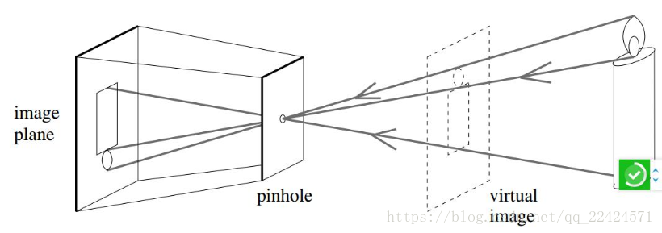
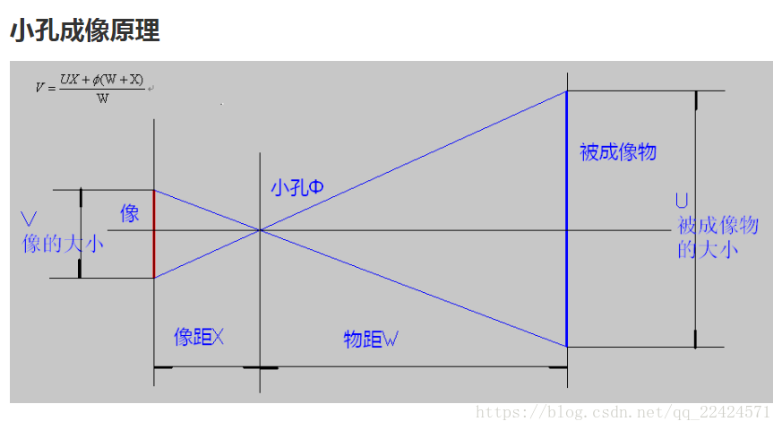
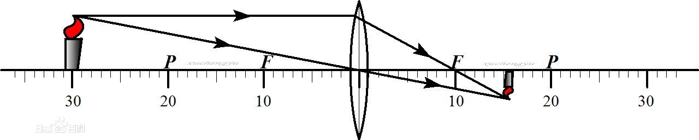
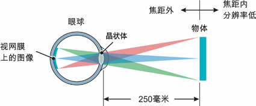
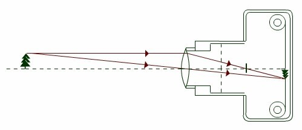
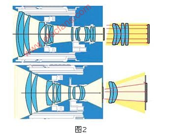
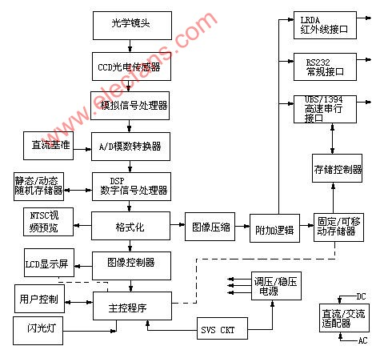
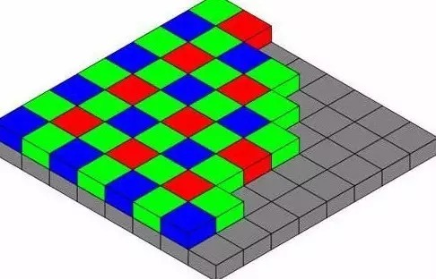

## 小孔成像

  
图1 小孔成像原理示意图 

  
图2 小孔成像原理示意图 

  
图3 小孔成像原理示意图  

## 人眼成像

  
图4 人眼成像原理示意图  

## 相机成像

  
图5 相机成像原理示意图  

  
图6 相机成像原理示意图  

## 相机工作原理

  
图6 相机工作流程图  

## 相机参数

### 1 镜头清晰度

高清成像元器件更小更密集，光线接受面积更小，也就是得色偏更小，从而使得边缘的骤变更小，进而使得图像色彩更加接近真实，边缘表现更加平滑。

  
图8 感光元器件示意图  

### 2 通光亮

经过镜头通过光线的多少。孔径越大则通光量越大。

##### 光圈
控制到达图像传感器光亮多少的部件

##### 光圈F值
镜头焦距与其有效直径的比值(f/o).用来表述到达图像传感器的光亮。（F值越小，通光口径越大，进光量越多，画面越明亮）

### 3 焦距
指从透镜的光心到焦点的距离。  
摄像范围因焦距的大小变化而变化。  
焦距越长，拍摄距离越近，光圈越明亮，虚化效果越强。  
焦距越长，需要的镜头口径越大，才能获得更多的通光亮。

### 4 景深
监视区域范围内能被清晰成像的区域。  
随着焦距的增加，景深范围变小。  
随着光圈值的增加（光圈孔变小）景深范围增大。  

### 5 畸变
桶形畸变  
枕形畸变  

