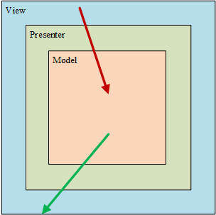

# [Android MVP 十分钟入门！]()

## 前言

在日常开发APP 的过程中，随着业务的扩展，规模的变化。我们的代码规模也会逐渐变得庞大，每一个类里的代码也会逐渐增多。尤其是Activity和Fragment ，由于Context 的存在，基本上所有对视图的操作我们只能在Activity和Fragment中完成；即便是对某些逻辑进行封装，Activity和Fragment 依旧会显得过于臃肿。因此，我们需要换一种思路去写代码，这个时候MVP模式就应用而生了！那么MVP 怎么用呢，下面就来说一说。

假设你现在如要实现下图中的功能：


这个需求很简单，就是点击按钮，下载一张图片，显示下载进度；下载完成后，在ImageView中显示这张图片。
下面我们就分别用传统的方式（也就是所谓的MVC)和MVP 模式分别取实现这个功能。然后分析一下MVP 到底好在哪里。

## MVC

```java
public class MVCActivity extends AppCompatActivity {

    private Context mContext;
    private ImageView mImageView;
    private MyHandler mMyHandler;
    private ProgressDialog progressDialog;

    @Override
    protected void onCreate(Bundle savedInstanceState) {
        super.onCreate(savedInstanceState);
        setContentView(R.layout.activity_mvc);
        mContext = this;
        init();
    }

    private void init() {
        //view init
        mImageView = (ImageView) findViewById(R.id.image);
        mMyHandler = new MyHandler();

        progressDialog = new ProgressDialog(mContext);
        progressDialog.setButton(DialogInterface.BUTTON_NEGATIVE, "Cancle", new DialogInterface.OnClickListener() {
            @Override
            public void onClick(DialogInterface dialog, int which) {
                progressDialog.dismiss();
            }
        });
        progressDialog.setCanceledOnTouchOutside(false);
        progressDialog.setTitle("下载文件");
        progressDialog.setProgressStyle(ProgressDialog.STYLE_HORIZONTAL);


        //click-event
        findViewById(R.id.downloadBtn).setOnClickListener(new View.OnClickListener() {
            @Override
            public void onClick(View v) {
                progressDialog.show();
                HttpUtil.HttpGet(Constants.DOWNLOAD_URL, new DownloadCallback(mMyHandler));
            }
        });

        findViewById(R.id.downloadBtn1).setOnClickListener(new View.OnClickListener() {
            @Override
            public void onClick(View v) {
                progressDialog.show();
                HttpUtil.HttpGet(Constants.DOWNLOAD_ERROR_URL, new DownloadCallback(mMyHandler));
            }
        });

    }


    class MyHandler extends Handler {
        @Override
        public void handleMessage(Message msg) {
            super.handleMessage(msg);
            switch (msg.what) {
                case 300:
                    int percent = msg.arg1;
                    if (percent < 100) {
                        progressDialog.setProgress(percent);
                    } else {
                        progressDialog.dismiss();
                        Glide.with(mContext).load(Constants.LOCAL_FILE_PATH).into(mImageView);
                    }
                    break;
                case 404:
                    progressDialog.dismiss();
                    Toast.makeText(mContext, "Download fail !", Toast.LENGTH_SHORT).show();
                    break;
                default:
                    break;
            }
        }
    }
}
```

用mvc的方式，一个Activity就能搞定。代码逻辑很简单，点击按钮后显示之前初始化好ProgressDialog，然后开始下载任务（这里HttpUtil 内部简单封装了OKHttp 的异步GET请求，实现下载文件保存到本地的功能，实现细节在此不做深入探讨，有兴趣的同学可以查看[源码](https://link.juejin.im/?target=https%3A%2F%2Fgithub.com%2FREBOOTERS%2FMy-MVP))，然后将请求结果通过Handler返回，在handleMessage中根据返回数据的信息做出不同的UI 处理；下载成功时在ImageView中显示图片，下载失败时Toast提示。

可以发现，在这种情况之前，Activity的任务十分繁重，既要负责下载任务的具体实施，还要根据下载进行再次的逻辑判断，才能去更新UI。这里只是一个简单的任务，你可能觉得无所谓，但是实际开发中，一个Activity中有许多的交互事件，这个时候Activity的代码就显得特别的庞大；一旦需求变更或出现bug，那简直就是噩梦一场。

因此，我们希望Activity可以变成下面这样

- 他负责发起处理和用户交互的内容，但又不负责具体的实现；
- 需要显示什么，不显示什么，什么东西显示多少，有个东西可以直接告诉他，
- Activity不再做复杂的逻辑处理；

具体到上面的demo里就是，Activity负责发起下载任务，但是不负责具体实现；什么时候显示ProgressDialog，显示多少？什么时候提示错误信息，这一切都希望有个东西能直接告诉Activity，而不再是在Activity里再做判断。怎样才能做到呢？那就得靠MVP 了。

## MVP

MVP 模式所做的事情很简单，就是将业务逻辑和视图逻辑抽象到接口中。

怎么理解呢，我们就根据此次要实现的下载功能，用代码说话。

###### 定义Model，View，Presenter 接口

### Model Interface

Model 接口定义所有需要实现的业务逻辑，在我们的下载任务中，业务逻辑只有一个，就是下载；因此Model 接口可以这么定义 ：

```java
public interface IDownloadModel {
    /**
     * 下载操作
     * @param url
     */
    void download(String url);
}
```

### View Interface

View 接口定义所有需要实现的视图逻辑，在我们的下载任务中，视图逻辑包括

- 显示ProgressDialog；
- 显示Dialog具体进度；
- 显示具体的View（设置图片）；
- 显示错误信息（Toast提示）

因此View接口可以这么定义：

```java
public interface IDownloadView {
    /**
     * 显示进度条
     * @param show
     */
    void showProgressBar(boolean show);

    /**
     * 设置进度条进度
     * @param progress
     */
    void setProcessProgress(int progress);

    /**
     * 根据数据设置view
     * @param result
     */
    void setView(String result);

    /**
     * 设置请求失败时的view
     */
    void showFailToast();
}
```

### Presenter Interface

Presenter 接口作为连接Model和View的中间桥梁，需要将二者连接起来，因此他需要完成以下工作：

- 执行下载任务
- 下载成功返回下载结果
- 下载过程返回下载进度
- 下载失败回调

因此，Presenter 就可以这么定义：

```java
public interface IDowndownPresenter {
    /**
     * 下载
     * @param url
     */
    void download(String url);

    /**
     * 下载成功
     * @param result
     */
    void downloadSuccess(String result);

    /**
     * 当前下载进度
     * @param progress
     */
    void downloadProgress(int progress);

    /**
     * 下载失败
     */
    void downloadFail();
}
```

###### 接口Model，View，Presenter 具体实现

上面实现了，各个接口的定义，下面来看看他们具体的实现：

### Model 具体实现

```java
public class DownloadModel implements IDownloadModel {
    private IDowndownPresenter mIDowndownPresenter;
    private MyHandler mMyHandler = new MyHandler();

    public DownloadModel(IDowndownPresenter IDowndownPresenter) {
        mIDowndownPresenter = IDowndownPresenter;
    }

    @Override
    public void download(String url) {
        HttpUtil.HttpGet(url, new DownloadCallback(mMyHandler));
    }

    class MyHandler extends Handler {
        @Override
        public void handleMessage(Message msg) {
            super.handleMessage(msg);
            switch (msg.what) {
                case 300:
                    int percent = msg.arg1;
                    if (percent < 100) {
                        mIDowndownPresenter.downloadProgress(percent);
                    } else {
                        mIDowndownPresenter.downloadSuccess(Constants.LOCAL_FILE_PATH);
                    }
                    break;
                case 404:
                    mIDowndownPresenter.downloadFail();
                    break;
                default:
                    break;
            }
        }
    }
}
```

在MVP模式中，Model的工作就是完成具体的业务操作，网络请求，持久化数据增删改查等任务。同时Model中又不会包含任何View。
这里Model的具体实现很简单，将Http任务的结果返回到Handler当中，而在Handler中的实现又是由Presenter完成。
那么Presenter接口又是怎样实现的呢？赶紧来看看

### Presenter 具体实现

```java
public class DownloadPresenter implements IDowndownPresenter {
    private IDownloadView mIDownloadView;
    private IDownloadModel mIDownloadModel;


    public DownloadPresenter(IDownloadView IDownloadView) {
        mIDownloadView = IDownloadView;
        mIDownloadModel = new DownloadModel(this);
    }

    @Override
    public void download(String url) {
        mIDownloadView.showProgressBar(true);
        mIDownloadModel.download(url);
    }

    @Override
    public void downloadSuccess(String result) {
        mIDownloadView.showProgressBar(false);
        mIDownloadView.setView(result);
    }

    @Override
    public void downloadProgress(int progress) {
        mIDownloadView.setProcessProgress(progress);
    }

    @Override
    public void downloadFail() {
        mIDownloadView.showProgressBar(false);
        mIDownloadView.showFailToast();
    }
}
```

可以看到，我们在DownloadPresenter的构造方法中，同时实例化了Model和View，这样Presenter中就同时包含了两者；
这样；在Presenter具体实现中，业务相关的操作由Model去完成（例如download），视图相关的操作由View去完成
（如setView等）。Presenter 作为桥梁的作用就这样体现出来了，巧妙的将View和Model的具体实现连接了起来。

### View具体实现

最后再看一下View接口的具体实现，也就是Activity的实现：

```java
public class MVPActivity extends AppCompatActivity implements IDownloadView {
    private Context mContext;
    private ImageView mImageView;
    private ProgressDialog progressDialog;

    private DownloadPresenter mDownloadPresenter;

    @Override
    protected void onCreate(Bundle savedInstanceState) {
        super.onCreate(savedInstanceState);
        mContext = this;
        setContentView(R.layout.activity_mvp);
        init();
    }

    private void init() {
        mDownloadPresenter = new DownloadPresenter(this);
        //view init
        mImageView = (ImageView) findViewById(R.id.image);
        findViewById(R.id.downloadBtn).setOnClickListener(new View.OnClickListener() {
            @Override
            public void onClick(View v) {
                mDownloadPresenter.download(Constants.DOWNLOAD_URL);
            }
        });

        findViewById(R.id.downloadBtn1).setOnClickListener(new View.OnClickListener() {
            @Override
            public void onClick(View v) {
                mDownloadPresenter.download(Constants.DOWNLOAD_ERROR_URL);
            }
        });

        progressDialog = new ProgressDialog(mContext);
        progressDialog.setButton(DialogInterface.BUTTON_NEGATIVE, "Cancle", new DialogInterface.OnClickListener() {
            @Override
            public void onClick(DialogInterface dialog, int which) {
                progressDialog.dismiss();
            }
        });
        progressDialog.setCanceledOnTouchOutside(false);
        progressDialog.setTitle("下载文件");
        progressDialog.setProgressStyle(ProgressDialog.STYLE_HORIZONTAL);

    }

    @Override
    public void showProgressBar(boolean show) {
        if (show) {
            progressDialog.show();
        } else {
            progressDialog.dismiss();
        }
    }

    @Override
    public void setProcessProgress(int progress) {
        progressDialog.setProgress(progress);
    }

    @Override
    public void setView(String result) {
        Glide.with(mContext).load(result).into(mImageView);
    }

    @Override
    public void showFailToast() {
        Toast.makeText(mContext, "Download fail !", Toast.LENGTH_SHORT).show();
    }
}
```

在点下按钮执行开始下载任务的时候，View（Activity）中没有具体的实现，只是调用了Presenter中的download方法，而Presenter中的download又会去调用Model的download方法，Model又会在根据具体逻辑（在这里就是Http请求）的状态去调用Presenter中的方法，例如我们在handleMessage方法中，调用mIDowndownPresenter.downloadProgress(percent)时，就会去调用Presenter的具体实现

```java
    @Override
    public void downloadProgress(int progress) {
        mIDownloadView.setProcessProgress(progress);
    }
```

而他的内部实现又是操作具体的View，也就是我们在Activity中初始化Presenter中传递的this，也就是当前Activity（View），这样最终回到了Activity中的

```java
    @Override
    public void setProcessProgress(int progress) {
        progressDialog.setProgress(progress);
    }
```

我们为progressDialog 设置进度。

至此，我们就通过MVP 的模式实现了我们之前所设想的Activity

Button的click方法负责发起下载任务，但又不负责具体实现，而是由Presenter转接给Model去实现  
Activity 什么时候显示ProgressDialog，什么时候显示Toast直接由Presenter告诉他，他只做一个View想做的事情  
Activity里没有任何逻辑处理，所有的逻辑判断都在Model中完成了。
这就是MVP ！！！

### MVC VS MVP
通过上面的两种实现方案，相信每个人都已经理解了MVC和MVP的区别；下面就其各自的优缺点再做一下
总结；当然，这里的优缺点只是相对而言。

#### 优点

MVC | MVP
 -- | -- 
  | 
上面两张图分别是MVC和MVP架构图。相信许多和我一样尝试去学习和了解MVP架构的同学对这两图（或类似的图）并不陌生。

1. [结构更加清晰]()  
    我们回过头再去看MVCActivity 的实现，暂且将我们对Http请求的封装归结为Model(M),那么剩下的就只有Activity了,而这个Activity即实现视图逻辑，又需要实现部分业务逻辑，也就是说他既是Controller（C）又是View（V）。V和C的划分完全不清晰；因此，传统的代码结构只能勉强称为MV 或者是MC，如果算上xml 的布局文件，才能牵强的称为MVC 结构。

    而MVP 就不同了，Model，View，Presenter各司其职，互相搭配，实现了解耦，完全解放了Activity（或者是Fragment）。这就是MVP 的优势，代码结构更加清晰。可以这样说，同一个模块的实现，甚至允许几个人分工完成；假设有一个非常复杂的Activity，如果使用MVP 的模式开发；那么这个时候，定义好MVP的接口之后，就可以有人专门去做Model，另一个人专门去做View；再由一个人写Presenter的代码，当然这需要极强的代码规范和协作能力；但这在传统的MVC模式中根本是无法想象的，所有的东西都在一个类里，两个人一起改，有了冲突怎么玩/(ㄒoㄒ)/~~。

2. [需求变更，不再是噩梦]()  
    假设现在有新的需求，产品经理认为下载失败后只有一个Toast提示太单调了（而且用户有可能错过了这Toast的显示，而误以为APP失去了响应），因此，现在希望在下载失败后弹出一个Dialog，可以重试下载任务。是想，如果代码使用传统的MVC 结构，恰巧这个代码不是你写的，或者说就是你写的，但是你已经忘记了具体的逻辑；那么为了实现这个需求你又得去重新捋一遍逻辑，到某个类的xxx行进行修改；但是如果使用MVP就不同了View接口已经定义好了showFailToast就是用来显示错误提示的；因此即便代码不是你写的，你都可以很快的找到，应该去哪里改；而省去很多时间。

3. [更容易写单元测试]()  
    这个就不展开说了，总之写过单元测试的人应该都有这样的体会。

### 缺点

MVP这么好，也不是没有缺点。


如图中所示，使用MVP 架构之后，多出了许多类；这是必然的；每一个View（Activity或Fragment）都至少需要各自的Model、Presenter和View接口，在加上他们各自的实现，也就是说每一个页面都会有6个java文件（算上Fragment或Activity，因为他就是View的实现），这样一个稍有点规模的APP，类就会变得异常的多，而每一个类的加载又会消耗资源；因此，相较于MVC，这算是MVP最大的缺点了吧。

当然，对于这个问题我们可以通过泛型参数、抽象父类的方式，将一些公用的Model及Presenter抽象出来。这应该就是使用MVP架构的精髓了。

## 最后

个人感觉，使用MVP 架构是利大于弊的；随着项目规模的增加，代码逻辑的清晰才是最重要的事情。况且Google官方也出推出了一系列关于[MVP的使用demo](https://link.juejin.im/?target=https%3A%2F%2Fgithub.com%2Fgooglesamples%2Fandroid-architecture)。  

因此，这也是官方提倡大家使用的。凡事，有利必有弊；类数目的增长是无法避免的事情，因此如何使用泛型和抽象优化MVP 的结构就变成了我们用好 MVP 的关键了。

当然，我们不能为了MVP而去MVP，如果项目结构不是很庞大，业务不是很复杂；那么传统的MVC 架构足以，而且也方便！

## 关于 new 和 构造函数传参

对象之间的调用传递关系，一种是通过 new Object()得到对象实例，一种是通过构造函数、或set方法传递。

- Model 和 Presenter， 上例中 Presenter 需要调用 Model 来完成具体的下载任务，而 Model 执行下载过程中也需要调用 Presenter 的方法来显示下载进度。
- Presenter 和 View， 当执行下载时 View 弹出 Dialog 显示下载进度，下载完成后关闭 Dialog 并在页面中显示图片。
- Presenter 同时和 Model、 View 建立关联关系，到底他们之间该采用哪种方式呢？
  在上例中，Model 获取 Presenter 是通过构造函数传递参数， Presenter 则是通过 new 方法。 View 获取 Presenter 是通过 new方法，而 Presenter 获取 View 则是通过构造函数传递参数。为什么会是这样呢？

  

  从上面的图形中可以看到， Presenter 作为 View 和 Model 交互的中间商，View 中点击事件触发数据请求， Presenter 直接将具体的数据请求任务转发给了 Model， Model 中对于图片下载的响应任务给了 Presenter ，Presenter 直接给了 View 去完成具体的 UI 响应。 当然也可以改变三者的对象传递关系，但是会使得调用逻辑变得混乱。

## 关于回调函数或 Listener

面向对象的五大基本原则

- 单一职责原则（SRP）
- 开放封闭原则（OCP） 
- 里氏替换原则（LSP） 
- 依赖倒置原则（DIP） 
- 接口隔离原则（ISP）


### 单一职责原则（SRP）

- 一个类应该仅有一个引起它变化的原因(最简单，最容易理解却最不容易做到的一个设计原则)

职员类例子：  
  比如在职员类里，将工程师、销售人员、销售经理这些情况都放在职员类里考虑，其结果将会非常混乱，在这个假设下，职员类里的每个方法都要if else判断是哪种情况，从类结构上来说将会十分臃肿，并且上述三种的职员类型，不论哪一种发生需求变化，都会改变职员类！这个是大家所不愿意看到的！

### 开放封闭原则（OCP）

- 既开放又封闭，对扩展是开放的，对更改是封闭的！
- 扩展即扩展现行的模块，当我们软件的实际应用发生改变时，出现新的需求，就需要我们对模块进行扩展，使其能够满足新的需求！

更改封闭即是在我们对模块进行扩展时，勿需对源有程序代码和DLL进行修改或重新编译文件！

这个原则对我们在设计类的时候很有帮助，坚持这个原则就必须尽量考虑接口封装，抽象机制和多态技术！


### 里氏替换原则（LSP）

- 子类可以替换父类并且出现在父类能够出现的任何地方
- 这个原则也是在贯彻GOF倡导的面向接口编程！

在这个原则中父类应尽可能使用接口或者抽象类来实现！
子类通过实现了父类接口，能够替父类的使用地方！

通过这个原则，客户端在使用父类接口的时候，通过子类实现！

意思就是说依赖父类接口，在客户端声明一个父类接口，通过其子类来实现
这个时候就要求子类必须能够替换父类所出现的任何地方，这样做的好处就是，在根据新要求扩展父类接口的新子类的时候而不影响当前客户端的使用！

### 依赖倒置原则（DIP）

- 传统的结构化编程中，最上层的模块通常都要依赖下面的子模块来实现，也称为高层依赖低层！

所以DIP原则就是要逆转这种依赖关系，让高层模块不要依赖低层模块，所以称之为依赖倒置原则！

### ISP 接口隔离原则

- 这个原则的意思是：使用多个专门的接口比使用单个接口要好的多！

根据 DIP 原则，为了避免高层的实现依赖底层，可以通过 Listener (或者回调)方式，将底层的实现延迟实现，将调用者和被调用者分离。
