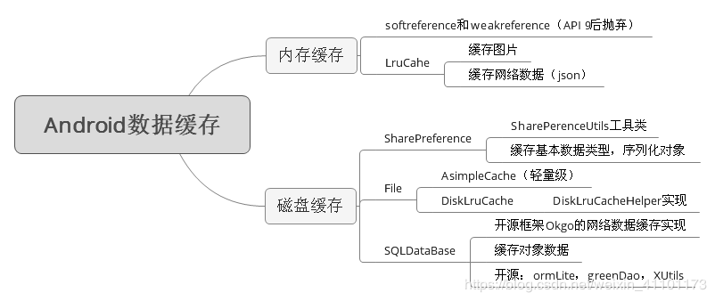

# [Android 中的缓存策略](https://blog.csdn.net/weixin_41101173/article/details/88757014)

## 一、前期基础知识储备

缓存策略在 Android 中有着广泛的使用场景，尤其在图片加载这个场景下，缓存策略更是尤为重要。加载图片是消耗流量的，如果用户加载图片，每次都要从网络中拉取，不但耗费更好的流量，同时加载速度也不是每次都可以接受的。如何避免过多的流量消耗呢？那就是 Android 中的缓存了。

当程序第一次从网络中加载图片之后，就将其缓存在存储设备上，这样下次使用这张图片就不用再从网络上获取了，这样就为用户节省了流量。很多时候为了提高用户的体验，往往还会把图片在内存中再缓存一份，这样当用户应用打算从网络上请求一张图片时，**程序会首先从内存中去获取，如果内存中没有那就从存储设备中去获取，如果存储设备中没有，那就从网络中下载这张图片。因为从内存中加载扸比从存储设备中加载图片要快**，所以这样既提高了程序的效率又为用户节约了不必要的流量开销。

上述的三级缓存策略不仅仅适用于图片，也适用于其他文件类型。

**缓存策略**：包括缓存的**添加、获取和删除**。不管是内存缓存还是存储设备缓存，它们的缓存大小都是有限制的，因此在使用缓存时总要为缓存指定一个最大的容量。如果当容量满了，但是程序还需要添加缓存，这个时候就需要删除一些旧的缓存并添加新的缓存，如何定义缓存的新旧这就是一种策略。

目前常用的一种缓存算法是**近期最少使用算法**(LRU, Least Recently Used). 它的核心思想就是当缓存满时，会优先淘汰那些近期最少使用的缓存对象。采用LRU算法的缓存有两种：LruCache和DiskLruCache，LruCache用于实现内存缓存，而DiskLruCache则充当了存储设备缓存，通过三者的完美结合，就可以很方便的实现一个具有很高实用价值的ImageLoader。



## 二 具体实现

### 2.1 LruCache

**LruCache** 是 Android 3.1 所提供的一个缓存类。为了兼容Android低版本，在使用 LruCache 时建议使用 support-v4 兼容包下的 LruCache，而不是直接使用 Android3.1 提供的 LruCache。

LruCache 是一个泛型类，它内部采用了一个 **LinkedHashMap** 以强引用的方式实现存储外界的缓存对象，其提供了 **get** 和 **put** 方法来完成缓存的获取和添加操作。

- 强引用：直接的对象引用；
- 软引用：当一个对象只有软引用存在时，系统内存不足时此对象会被gc回收；
- 弱引用：当一个对象只用弱引用存在时，此对象会随时被 gc 回收。

LruCache 的实现比较简单，以下是使用 LruCache 来实现内存缓存：

#### 2.1.1 LruCache 的典型初始化过程

```java
int maxMemory = (int) (Runtime.getRuntime().maxMemory() / 1024);
int cacheSize = maxMemory / 8; // 总容量为当前进程的可用内存的1/8
mMemoryCache = new LruCache<String, Bitmap>(cacheSize) {
    //sizeOf 方法用以计算缓存对象的大小 比如 Bitmap 对象的大小
    @Override
    protected int sizeOf(String key, Bitmap bitmap) {
        return bitmap.getRowBytes() * bitmap.getHeight() / 1024;
    }
};
```

> - 上述代码中，只需要提供缓存的总容量大小并重写sizeOf方法即可。sizeOf 方法的作用是计算缓存对象的大小，这里的大小单位和总容量的单位一致。  
> - 对于上面的示例代码来说，总容量大小为当前进程可用内存的 1/8，单位为 KB。而 sizeOf 方法则完成了 Bitmap 对象的大小计算。

#### 2.1.2 LruCache 的添加、获取和删除

- 获取  
mMemoryCache.get(key)

- 添加  
  mMemoryCache.put(key, bitmap)

- 删除  
  remove(key)

> 从 Android3.1 开始，LruCache 就是 Android 源码的一部分了。

### 2.2 DiskLruCache

DiskLruCache 用于实现存储设备缓存，即磁盘缓存，它通过将缓存对象写入文件系统，从而实现缓存的效果。DiskLruCache 得到了 Android 官方文档的推荐，但它不属于 AndroidSDK 的一部分，可以从网上找到它的源码，修改后添加到项目中。

#### 2.2.1 DiskLruCache的创建

DiskLruCache 并不能通过构造方法来创建，它提供了 open 方法用于创建自身：

```java
public static DiskLruCache open (File directory, int appVersion, int valueCount, long maxSize)
```

open 方法有四个参数，其中

- 第一个参数：表示磁盘缓存在文件系统中的存储路径。缓存路径可以选择SD卡上的缓存目录，具体是指 `/sdcard/Android/data/package_name/cache` 目录，其中 `package_name` 表示当前应用的包名，当应用被卸载后，此目录会一并被删除。  
这里给出一个**建议**： 如果应用卸载后就希望删除缓存文件，那么就选择SD卡上的缓存目录，如果希望保留缓存数据那就应该选择SD卡上的其他特定目录；

- 第二个参数：表示应用的版本号，设为1即可；

- 第三个参数：表示单个节点所对应的数据个数大小，一般设为1即可；

- 第四个参数：表示缓存的总大小，当缓存超过这个设定值后，DiskLruCache就会自行清除一些缓存。

```java
private static final long DISK_CACHE_SIZE = 1024 * 1024 * 50; //50MB

File diskCacheDir = getDiskCacheDir(mContext, "bitmap");
if (!diskCacheDir.exists()) {
    diskCacheDir.mkdirs();
}
if (getUsableSpace(diskCacheDir) > DISK_CACHE_SIZE) {
    try {
        mDiskLruCache = DiskLruCache.open(diskCacheDir, 1, 1,
                DISK_CACHE_SIZE);
        mIsDiskLruCacheCreated = true;
    } catch (IOException e) {
        e.printStackTrace();
    }
}
```

#### 2.2.2 DiskLruCache 的缓存添加

DiskLruCache 的缓存添加操作是通过 **Editor** 对象完成的，Editor 表示一个缓存对象的编辑对象。这里以图片缓存为例。

- 首先需要获取图片 url 对应的 key，
- 然后根据 key 就可以 edit() 来获取Editor对象，如果这个对象正在被编辑，那么 edit() 就会返回 null。

> 之所以把url转换成key，是因为图片的url中很可能有特殊字符，这将影响 url 在 Android 中的直接使用，一般采用 url 的 md5 值作为 key。

```java
//url转key DisLruCache 添加+读取
private String hashKeyFormUrl(String url) {
    String cacheKey;
    try {
        final MessageDigest mDigest = MessageDigest.getInstance("MD5");
        mDigest.update(url.getBytes());
        cacheKey = bytesToHexString(mDigest.digest());
    } catch (NoSuchAlgorithmException e) {
        cacheKey = String.valueOf(url.hashCode());
    }
    return cacheKey;
}

private String bytesToHexString(byte[] bytes) {
    StringBuilder sb = new StringBuilder();
    for (int i = 0; i < bytes.length; i++) {
        String hex = Integer.toHexString(0xFF & bytes[i]);
        if (hex.length() == 1) {
            sb.append('0');
        }
        sb.append(hex);
    }
    return sb.toString();
}
```

将图片的 url 转为 key 之后，就可以获取 Editor 对象了。对于这个key来说，如果当前不存在其他 Editor 对象，那么 edit() 就会返回一个新的 Editor 对象，通过它就可以得到一个文件输出流。

```java
String key = hashKeyFormUrl(url);
DiskLruCache.Editor editor = mDiskLruCache.edit(key);
if (editor != null) {
    OutputStream outputStream = editor.newOutputStream(DISK_CACHE_INDEX);
}
```

当从网络中下载图片时，图片就可以通过这个文件输出流写入到文件系统上:

```java
public boolean downloadUrlToStream(String urlString,
        OutputStream outputStream) {
    HttpURLConnection urlConnection = null;
    BufferedOutputStream out = null;
    BufferedInputStream in = null;

    try {
        final URL url = new URL(urlString);
        urlConnection = (HttpURLConnection) url.openConnection();
        in = new BufferedInputStream(urlConnection.getInputStream(),
                IO_BUFFER_SIZE);
        out = new BufferedOutputStream(outputStream, IO_BUFFER_SIZE);

        int b;
        while ((b = in.read()) != -1) {
            out.write(b);
        }
        return true;
    } catch (IOException e) {
        Log.e(TAG, "downloadBitmap failed." + e);
    } finally {
        if (urlConnection != null) {
            urlConnection.disconnect();
        }
        MyUtils.close(out);
        MyUtils.close(in);
    }
    return false;
}
```

经过上面的步骤，其实并没有真正将图片写入文件系统，还必须通过 Editor 的 **commit()** 来提交写入操作，如果图片下载过程发生了异常，那么还可以通过 Editor 的 **abort()** 来回退整个操作。

```java
OutputStream outputStream = editor.newOutputStream(DISK_CACHE_INDEX);
if (downloadUrlToStream(url, outputStream)) {// 图片下载正常
    editor.commit();
} else {// 图片下载异常
    editor.abort();
}
mDiskLruCache.flush();
```

经过上面几个步骤，图片就已经被正确地写入到文件系统中，接下来图片的获取操作就不需要请求网络了。

#### 2.2.3 DiskLruCache 的缓存查找

和缓存的添加过程类似，缓存的查找过程也需要将 url 转化为 key，然后通过 DiskLruCache 的 **get** 方法得到一个 **Snapshot** 对象，接着再通过 Snapshot 对象即可得到缓存的文件输入流，有了文件输出流，自然就可以得到 Bitmap 对象了。为了避免图片加载过程中导致的 OOM 问题，一般不建议直接加载原始图片。可以通过文件流来得到它所对应的文件描述符，然后再通过 **BitmapFactory.decodeFileDescriptor()** 方法来加载一整缩放后的图片。实现如下：

```java
Bitmap bitmap = null;
String key = hashKeyFormUrl(url);
DiskLruCache.Snapshot snapShot = mDiskLruCache.get(key);
if (snapShot != null) {
    FileInputStream fileInputStream = (FileInputStream)snapShot.getInputStream(DISK_CACHE_INDEX);
    FileDescriptor fileDescriptor = fileInputStream.getFD();
    bitmap = mImageResizer.decodeSampledBitmapFromFileDescriptor(fileDescriptor,
            reqWidth, reqHeight);
    if (bitmap != null) {
        addBitmapToMemoryCache(key, bitmap);
    }
}
```

除了上述方法之外，DiskLruCache 还提供了 **remove** 和 **delete** 方法来用于磁盘缓存的删除操作。

## 三、ImageLoader 实现

一般来说，一个优秀的ImageLoader应该具备如下功能：

- 图片的同步加载
- 图片的异步加载
- 图片压缩
- 内存缓存
- 磁盘缓存
- 网络拉取

**图片的同步加载**是指能够以同步的方式向调用者提供所加载的图片；**图片的异步加载**是一个很有用的功能，很多时候调用者不想在单独的线程中以同步的方式来获取图片，这个时候 ImageLoader 内部就需要自己在线程中加载图片并将图片甚至所需的 ImageView。**图片压缩**的作用更加毋庸置疑了，这是降低 OOM 概率的有效手段，ImageLoader 必须合理地处理图片的压缩问题。**内存缓存和磁盘缓存**是 ImageLoader 的核心。

> 以下为完整实现

### 3.1 ImageLoader

```java
/**
 * 缓存：当应用第一次从网络加载图片之后，就将其缓存到内存和存储设备中，下次使用时就不必再从网络中获取；
 *
 * 三级缓存：再次请求时，先访问内存，没有就再去访问存储设备，如果两者都没有再从网络中进行下载；
 *
 * 缓存三要素：添加、读取、删除
 *
 * 缓存算法：LRU，近期使用最少算法，采用LRU算法的缓存有两种：LruCache 和 DisLruCache
 *
 * LruCache：Android3.1提供的缓存类，v4包下可以兼容到早期版本。线程安全，提供了 get 和 put 方法来完成获取和添加操作
 * 
 * DisLruCache：没有加入源码，本项目中可以copy一份出来。将缓存对象写入文件系统，从而实现缓存的效果。
 *  创建：open()①SD卡上的缓存目录(getDiskCacheDir(context,"name")getCacheDir/getExternalCacheDir)，②1；③1；④缓存的总容量。
 *  添加：Editor缓存对象的编辑对象，url转为key，根据key通过edit()来获取Editor对象，通过后者可以获取到一个文件输出流(OutputStream)，然后写入到文件系统中。commit提交；abort回退。
 *        OutputStream outputStream = editor.newOutputStream(DISK_CACHE_INDEX);
 *  查找：添加类似：url转为key，通过get方法获取Snapshot对象，通过后者获取一个文件输入流，有了文件输入流(FileInputStream)，自然可以得到Bitmap查找对象了。
 *        FileInputStream fileInputStream = (FileInputStream)snapShot.getInputStream(DISK_CACHE_INDEX);
 *  为了避免加载图片过程中导致的OOM问题，一般不建议直接加载原始图片，磁盘缓存时使用BitmapFactory.decodeFileDescriptor(）方法来加载一张缩放后的图片。
 *
 *  加载的对象会优先缓存在磁盘缓存中，添加缓存成功后再往内存中缓存一份。读取的顺序是反过来的。
 */
public class ImageLoader {
 
    private static final String TAG = "ImageLoader";
 
    public static final int MESSAGE_POST_RESULT = 1;
 
    private static final int CPU_COUNT = Runtime.getRuntime().availableProcessors();
 
    private static final int CORE_POOL_SIZE = CPU_COUNT + 1;
    private static final int MAXIMUM_POOL_SIZE = CPU_COUNT * 2 + 1;
    private static final long KEEP_ALIVE = 10L;
 
    private static final int TAG_KEY_URI = R.id.imageloader_uri;
    private static final long DISK_CACHE_SIZE = 1024 * 1024 * 50; //50MB
    private static final int IO_BUFFER_SIZE = 8 * 1024;
    private static final int DISK_CACHE_INDEX = 0;
    private boolean mIsDiskLruCacheCreated = false;
 
    private static final ThreadFactory sThreadFactory = new ThreadFactory() {
        private final AtomicInteger mCount = new AtomicInteger(1);
 
        public Thread newThread(Runnable r) {
            return new Thread(r, "ImageLoader#" + mCount.getAndIncrement());
        }
    };
 
    //创建线程池 用于执行网络请求这一耗时操作
    public static final Executor THREAD_POOL_EXECUTOR = new ThreadPoolExecutor(
            CORE_POOL_SIZE, MAXIMUM_POOL_SIZE,
            KEEP_ALIVE, TimeUnit.SECONDS,
            new LinkedBlockingQueue<Runnable>(), sThreadFactory);
 
    //创建Handler 用于发送消息 切回主线程执行UI操作
    private Handler mMainHandler = new Handler(Looper.getMainLooper()) {
        @Override
        public void handleMessage(Message msg) {
            LoaderResult result = (LoaderResult) msg.obj;
            ImageView imageView = result.imageView;
            String uri = (String) imageView.getTag(TAG_KEY_URI);
            if (uri.equals(result.uri)) {
                imageView.setImageBitmap(result.bitmap);
            } else {
                Log.w(TAG, "set image bitmap,but url has changed, ignored!");
            }
        };
    };
 
    private Context mContext;
    private ImageResizer mImageResizer = new ImageResizer();
    private LruCache<String, Bitmap> mMemoryCache; // 内存缓存
    private DiskLruCache mDiskLruCache; // 磁盘缓存
 
    private ImageLoader(Context context) {
        mContext = context.getApplicationContext();
        // 内存缓存 LruCache初始化
        int maxMemory = (int) (Runtime.getRuntime().maxMemory() / 1024);
        int cacheSize = maxMemory / 8; // 总容量为当前进程的可用内存的1/8
        mMemoryCache = new LruCache<String, Bitmap>(cacheSize) {
            @Override
            protected int sizeOf(String key, Bitmap bitmap) {
                //sizeOf方法用以计算缓存对象的大小 比如Bitmap对象的大小
                return bitmap.getRowBytes() * bitmap.getHeight() / 1024;
            }
        };
        // 磁盘缓存 DisLruCache初始化
        File diskCacheDir = getDiskCacheDir(mContext, "bitmap");
        if (!diskCacheDir.exists()) {
            diskCacheDir.mkdirs();
        }
        if (getUsableSpace(diskCacheDir) > DISK_CACHE_SIZE) {
            try {
                mDiskLruCache = DiskLruCache.open(diskCacheDir, 1, 1,
                        DISK_CACHE_SIZE);
                mIsDiskLruCacheCreated = true;
            } catch (IOException e) {
                e.printStackTrace();
            }
        }
    }
 
    /**
     * build a new instance of ImageLoader
     * @param context
     * @return a new instance of ImageLoader
     */
    public static ImageLoader build(Context context) {
        return new ImageLoader(context);
    }
 
    // 添加进LruCache 添加缓存对象
    private void addBitmapToMemoryCache(String key, Bitmap bitmap) {
        if (getBitmapFromMemCache(key) == null) {
            mMemoryCache.put(key, bitmap);
        }
    }
 
    // LruCache读取出 获取缓存对象
    private Bitmap getBitmapFromMemCache(String key) {
        return mMemoryCache.get(key);
    }
 
    /**
     * 异步加载图片
     * load bitmap from memory cache or disk cache or network async, then bind imageView and bitmap.
     * NOTE THAT: should run in UI Thread
     * @param uri http url
     * @param imageView bitmap's bind object
     */
    public void bindBitmap(final String uri, final ImageView imageView) {
        bindBitmap(uri, imageView, 0, 0);
    }
 
    public void bindBitmap(final String uri, final ImageView imageView,
            final int reqWidth, final int reqHeight) {
        imageView.setTag(TAG_KEY_URI, uri);
        Bitmap bitmap = loadBitmapFromMemCache(uri);
        if (bitmap != null) {
            imageView.setImageBitmap(bitmap);
            return;
        }
 
        Runnable loadBitmapTask = new Runnable() {
 
            @Override
            public void run() {
                Bitmap bitmap = loadBitmap(uri, reqWidth, reqHeight);
                if (bitmap != null) {
                    LoaderResult result = new LoaderResult(imageView, uri, bitmap);
                    mMainHandler.obtainMessage(MESSAGE_POST_RESULT, result).sendToTarget();
                }
            }
        };
        THREAD_POOL_EXECUTOR.execute(loadBitmapTask);
    }
 
    /**
     * 同步加载图片
     * load bitmap from memory cache or disk cache or network.
     * @param uri http url
     * @param reqWidth the width ImageView desired
     * @param reqHeight the height ImageView desired
     * @return bitmap, maybe null.
     */
    public Bitmap loadBitmap(String uri, int reqWidth, int reqHeight) {
        Bitmap bitmap = loadBitmapFromMemCache(uri); // 内存缓存中读取
        if (bitmap != null) {
            Log.d(TAG, "loadBitmapFromMemCache,url:" + uri);
            return bitmap;
        }
 
        try {
            bitmap = loadBitmapFromDiskCache(uri, reqWidth, reqHeight); // 磁盘缓存的查找 即读取
            if (bitmap != null) {
                Log.d(TAG, "loadBitmapFromDisk,url:" + uri);
                return bitmap;
            }
            bitmap = loadBitmapFromHttp(uri, reqWidth, reqHeight); // 磁盘缓存的添加 当磁盘缓存查找失败时调用该方法
            Log.d(TAG, "loadBitmapFromHttp,url:" + uri);
        } catch (IOException e) {
            e.printStackTrace();
        }
 
        if (bitmap == null && !mIsDiskLruCacheCreated) {
            Log.w(TAG, "encounter error, DiskLruCache is not created.");
            bitmap = downloadBitmapFromUrl(uri); // 前面两次读取缓存Bitmap失败 重现调用网络拉取
        }
 
        return bitmap;
    }
 
    // LruCache加载图片 调用上面的方法
    private Bitmap loadBitmapFromMemCache(String url) {
        final String key = hashKeyFormUrl(url);
        return getBitmapFromMemCache(key);
    }
 
    //DisLruCache 添加 Editor -耗时操作
    //添加的方法最终会在最后调用一次磁盘查找的方法，返回一个Bitmap，所以这是一个有返回值的方法
    private Bitmap loadBitmapFromHttp(String url, int reqWidth, int reqHeight)
            throws IOException {
        // 写入磁盘的操作是耗时操作 不能在主线程中执行 利用主线程Looper进行判断是否为主线程
        if (Looper.myLooper() == Looper.getMainLooper()) {
            throw new RuntimeException("can not visit network from UI Thread.");
        }
        if (mDiskLruCache == null) {
            return null;
        }
        
        String key = hashKeyFormUrl(url);
        DiskLruCache.Editor editor = mDiskLruCache.edit(key);
        if (editor != null) {
            OutputStream outputStream = editor.newOutputStream(DISK_CACHE_INDEX);
            if (downloadUrlToStream(url, outputStream)) {
                // 图片下载正常
                editor.commit();
            } else {
                // 图片下载异常
                editor.abort();
            }
            mDiskLruCache.flush();
        }
        return loadBitmapFromDiskCache(url, reqWidth, reqHeight);
    }
 
    //DisLruCache 缓存查找 Snapshot -耗时操作
    //磁盘缓存的查找方法，得到查找对象后，会调用内存缓存的添加方法，将对象添加进内存中
    private Bitmap loadBitmapFromDiskCache(String url, int reqWidth,
            int reqHeight) throws IOException {
        // 读取磁盘的操作是耗时操作 不能在主线程中执行 利用主线程Looper进行判断是否为主线程
        if (Looper.myLooper() == Looper.getMainLooper()) {
            Log.w(TAG, "load bitmap from UI Thread, it's not recommended!");
        }
        if (mDiskLruCache == null) {
            return null;
        }
 
        Bitmap bitmap = null;
        String key = hashKeyFormUrl(url);
        DiskLruCache.Snapshot snapShot = mDiskLruCache.get(key);
        if (snapShot != null) {
            FileInputStream fileInputStream = (FileInputStream)snapShot.getInputStream(DISK_CACHE_INDEX);
            FileDescriptor fileDescriptor = fileInputStream.getFD();
            bitmap = mImageResizer.decodeSampledBitmapFromFileDescriptor(fileDescriptor,
                    reqWidth, reqHeight);
            if (bitmap != null) {
                addBitmapToMemoryCache(key, bitmap);
            }
        }
        return bitmap;
    }
 
    //外界调用该方法时传入文件输出流对象，和Url，就可以直接将下载好的图片写入到文件系统上
    //DisLruCache判断下载是否异常 写入是否成功 最后决定是com_mit() 还是ab_ort()
    //通过Editor对象获取文件输出流之后，当从网络中下载图片之后，再利用这个输出流将图片写入到文件系统上
    // OutputStream输出流 write()写入方法
    // 注意这里已经执行了从网络中拉取图片的方法，所以调用磁盘添加方法时，实际已经进行了网络图片的拉取
    public boolean downloadUrlToStream(String urlString,
            OutputStream outputStream) {
        HttpURLConnection urlConnection = null;
        BufferedOutputStream out = null;
        BufferedInputStream in = null;
 
        try {
            final URL url = new URL(urlString);
            urlConnection = (HttpURLConnection) url.openConnection();
            in = new BufferedInputStream(urlConnection.getInputStream(),
                    IO_BUFFER_SIZE);
            out = new BufferedOutputStream(outputStream, IO_BUFFER_SIZE);
 
            int b;
            while ((b = in.read()) != -1) {
                out.write(b);
            }
            return true;
        } catch (IOException e) {
            Log.e(TAG, "downloadBitmap failed." + e);
        } finally {
            if (urlConnection != null) {
                urlConnection.disconnect();
            }
            MyUtils.close(out);
            MyUtils.close(in);
        }
        return false;
    }
 
    // HttpURL_Connection 网络拉取图片
    private Bitmap downloadBitmapFromUrl(String urlString) {
        Bitmap bitmap = null;
        HttpURLConnection urlConnection = null;
        BufferedInputStream in = null;
 
        try {
            final URL url = new URL(urlString);
            urlConnection = (HttpURLConnection) url.openConnection();
            in = new BufferedInputStream(urlConnection.getInputStream(),
                    IO_BUFFER_SIZE);
            bitmap = BitmapFactory.decodeStream(in);
        } catch (final IOException e) {
            Log.e(TAG, "Error in downloadBitmap: " + e);
        } finally {
            if (urlConnection != null) {
                urlConnection.disconnect();
            }
            MyUtils.close(in);
        }
        return bitmap;
    }
 
    //url转key DisLruCache 添加+读取
    private String hashKeyFormUrl(String url) {
        String cacheKey;
        try {
            final MessageDigest mDigest = MessageDigest.getInstance("MD5");
            mDigest.update(url.getBytes());
            cacheKey = bytesToHexString(mDigest.digest());
        } catch (NoSuchAlgorithmException e) {
            cacheKey = String.valueOf(url.hashCode());
        }
        return cacheKey;
    }
 
    private String bytesToHexString(byte[] bytes) {
        StringBuilder sb = new StringBuilder();
        for (int i = 0; i < bytes.length; i++) {
            String hex = Integer.toHexString(0xFF & bytes[i]);
            if (hex.length() == 1) {
                sb.append('0');
            }
            sb.append(hex);
        }
        return sb.toString();
    }
 
    public File getDiskCacheDir(Context context, String uniqueName) {
        boolean externalStorageAvailable = Environment
                .getExternalStorageState().equals(Environment.MEDIA_MOUNTED);
        final String cachePath;
        if (externalStorageAvailable) {
            cachePath = context.getExternalCacheDir().getPath();
            //  -/storage/emulated/0/Android/data/com.camera.fhuji.camera/cache 应用数据目录下的外部存储目录，优先使用
        } else {
            cachePath = context.getCacheDir().getPath();
            //  -/data/user/0/com.camera.fhuji.camera/cache 应用数据目录下的内部存储目录，尽量少用
        }
        //  -/storage/emulated/0/Android/data/com.camera.fhuji.camera/cache/bitmap
        return new File(cachePath + File.separator + uniqueName);
    }
 
    @TargetApi(VERSION_CODES.GINGERBREAD)
    private long getUsableSpace(File path) {
        if (Build.VERSION.SDK_INT >= VERSION_CODES.GINGERBREAD) {
            return path.getUsableSpace();
        }
        final StatFs stats = new StatFs(path.getPath());
        return (long) stats.getBlockSize() * (long) stats.getAvailableBlocks();
    }
 
    private static class LoaderResult {
        public ImageView imageView;
        public String uri;
        public Bitmap bitmap;
 
        public LoaderResult(ImageView imageView, String uri, Bitmap bitmap) {
            this.imageView = imageView;
            this.uri = uri;
            this.bitmap = bitmap;
        }
    }
}
```

### 3.2 图片压缩 ImageResizer

```java
public class ImageResizer {
    private static final String TAG = "ImageResizer";
 
    public ImageResizer() {
    }
 
    public Bitmap decodeSampledBitmapFromResource(Resources res,
            int resId, int reqWidth, int reqHeight) {
        // First decode with inJustDecodeBounds=true to check dimensions
        final BitmapFactory.Options options = new BitmapFactory.Options();
        options.inJustDecodeBounds = true;
        BitmapFactory.decodeResource(res, resId, options);
 
        // Calculate inSampleSize
        options.inSampleSize = calculateInSampleSize(options, reqWidth,
                reqHeight);
 
        // Decode bitmap with inSampleSize set
        options.inJustDecodeBounds = false;
        return BitmapFactory.decodeResource(res, resId, options);
    }
 
    public Bitmap decodeSampledBitmapFromFileDescriptor(FileDescriptor fd, int reqWidth, int reqHeight) {
        // First decode with inJustDecodeBounds=true to check dimensions
        final BitmapFactory.Options options = new BitmapFactory.Options();
        options.inJustDecodeBounds = true;
        BitmapFactory.decodeFileDescriptor(fd, null, options);
 
        // Calculate inSampleSize
        options.inSampleSize = calculateInSampleSize(options, reqWidth,
                reqHeight);
 
        // Decode bitmap with inSampleSize set
        options.inJustDecodeBounds = false;
        return BitmapFactory.decodeFileDescriptor(fd, null, options);
    }
 
    public int calculateInSampleSize(BitmapFactory.Options options,
            int reqWidth, int reqHeight) {
        if (reqWidth == 0 || reqHeight == 0) {
            return 1;
        }
 
        // Raw height and width of image
        final int height = options.outHeight;
        final int width = options.outWidth;
        Log.d(TAG, "origin, w= " + width + " h=" + height);
        int inSampleSize = 1;
 
        if (height > reqHeight || width > reqWidth) {
            final int halfHeight = height / 2;
            final int halfWidth = width / 2;
 
            // Calculate the largest inSampleSize value that is a power of 2 and
            // keeps both
            // height and width larger than the requested height and width.
            while ((halfHeight / inSampleSize) >= reqHeight
                    && (halfWidth / inSampleSize) >= reqWidth) {
                inSampleSize *= 2;
            }
        }
 
        Log.d(TAG, "sampleSize:" + inSampleSize);
        return inSampleSize;
    }
}
```

### 3.3 Activity 中使用 ImageLoader

```java
 mImageLoader.bindBitmap(uri, imageView, mImageWidth, mImageWidth);
```

### 3.4 附录：DiskLruCache源码（自主添加进项目）

```java
/*
 * Copyright (C) 2011 The Android Open Source Project
 *
 * Licensed under the Apache License, Version 2.0 (the "License");
 * you may not use this file except in compliance with the License.
 * You may obtain a copy of the License at
 *
 *      http://www.apache.org/licenses/LICENSE-2.0
 *
 * Unless required by applicable law or agreed to in writing, software
 * distributed under the License is distributed on an "AS IS" BASIS,
 * WITHOUT WARRANTIES OR CONDITIONS OF ANY KIND, either express or implied.
 * See the License for the specific language governing permissions and
 * limitations under the License.
 */
 
package com.camera.fhuji.camera.art.loader;
 
import java.io.BufferedInputStream;
import java.io.BufferedWriter;
import java.io.Closeable;
import java.io.EOFException;
import java.io.File;
import java.io.FileInputStream;
import java.io.FileNotFoundException;
import java.io.FileOutputStream;
import java.io.FileWriter;
import java.io.FilterOutputStream;
import java.io.IOException;
import java.io.InputStream;
import java.io.InputStreamReader;
import java.io.OutputStream;
import java.io.OutputStreamWriter;
import java.io.Reader;
import java.io.StringWriter;
import java.io.Writer;
import java.lang.reflect.Array;
import java.nio.charset.Charset;
import java.util.ArrayList;
import java.util.Arrays;
import java.util.Iterator;
import java.util.LinkedHashMap;
import java.util.Map;
import java.util.concurrent.Callable;
import java.util.concurrent.ExecutorService;
import java.util.concurrent.LinkedBlockingQueue;
import java.util.concurrent.ThreadPoolExecutor;
import java.util.concurrent.TimeUnit;
 
/**
 ******************************************************************************
 * Taken from the JB source code, can be found in:
 * libcore/luni/src/main/java/libcore/io/DiskLruCache.java
 * or direct link:
 * https://android.googlesource.com/platform/libcore/+/android-4.1.1_r1/luni/src/main/java/libcore/io/DiskLruCache.java
 ******************************************************************************
 *
 * A cache that uses a bounded amount of space on a filesystem. Each cache
 * entry has a string key and a fixed number of values. Values are byte
 * sequences, accessible as streams or files. Each value must be between {@code
 * 0} and {@code Integer.MAX_VALUE} bytes in length.
 *
 * <p>The cache stores its data in a directory on the filesystem. This
 * directory must be exclusive to the cache; the cache may delete or overwrite
 * files from its directory. It is an error for multiple processes to use the
 * same cache directory at the same time.
 *
 * <p>This cache limits the number of bytes that it will store on the
 * filesystem. When the number of stored bytes exceeds the limit, the cache will
 * remove entries in the background until the limit is satisfied. The limit is
 * not strict: the cache may temporarily exceed it while waiting for files to be
 * deleted. The limit does not include filesystem overhead or the cache
 * journal so space-sensitive applications should set a conservative limit.
 *
 * <p>Clients call {@link #edit} to create or update the values of an entry. An
 * entry may have only one editor at one time; if a value is not available to be
 * edited then {@link #edit} will return null.
 * <ul>
 *     <li>When an entry is being <strong>created</strong> it is necessary to
 *         supply a full set of values; the empty value should be used as a
 *         placeholder if necessary.
 *     <li>When an entry is being <strong>edited</strong>, it is not necessary
 *         to supply data for every value; values default to their previous
 *         value.
 * </ul>
 * Every {@link #edit} call must be matched by a call to {@link Editor#commit}
 * or {@link Editor#abort}. Committing is atomic: a read observes the full set
 * of values as they were before or after the commit, but never a mix of values.
 *
 * <p>Clients call {@link #get} to read a snapshot of an entry. The read will
 * observe the value at the time that {@link #get} was called. Updates and
 * removals after the call do not impact ongoing reads.
 *
 * <p>This class is tolerant of some I/O errors. If files are missing from the
 * filesystem, the corresponding entries will be dropped from the cache. If
 * an error occurs while writing a cache value, the edit will fail silently.
 * Callers should handle other problems by catching {@code IOException} and
 * responding appropriately.
 */
public final class DiskLruCache implements Closeable {
    static final String JOURNAL_FILE = "journal";
    static final String JOURNAL_FILE_TMP = "journal.tmp";
    static final String MAGIC = "libcore.io.DiskLruCache";
    static final String VERSION_1 = "1";
    static final long ANY_SEQUENCE_NUMBER = -1;
    private static final String CLEAN = "CLEAN";
    private static final String DIRTY = "DIRTY";
    private static final String REMOVE = "REMOVE";
    private static final String READ = "READ";
 
    private static final Charset UTF_8 = Charset.forName("UTF-8");
    private static final int IO_BUFFER_SIZE = 8 * 1024;
 
    /*
     * This cache uses a journal file named "journal". A typical journal file
     * looks like this:
     *     libcore.io.DiskLruCache
     *     1
     *     100
     *     2
     *
     *     CLEAN 3400330d1dfc7f3f7f4b8d4d803dfcf6 832 21054
     *     DIRTY 335c4c6028171cfddfbaae1a9c313c52
     *     CLEAN 335c4c6028171cfddfbaae1a9c313c52 3934 2342
     *     REMOVE 335c4c6028171cfddfbaae1a9c313c52
     *     DIRTY 1ab96a171faeeee38496d8b330771a7a
     *     CLEAN 1ab96a171faeeee38496d8b330771a7a 1600 234
     *     READ 335c4c6028171cfddfbaae1a9c313c52
     *     READ 3400330d1dfc7f3f7f4b8d4d803dfcf6
     *
     * The first five lines of the journal form its header. They are the
     * constant string "libcore.io.DiskLruCache", the disk cache's version,
     * the application's version, the value count, and a blank line.
     *
     * Each of the subsequent lines in the file is a record of the state of a
     * cache entry. Each line contains space-separated values: a state, a key,
     * and optional state-specific values.
     *   o DIRTY lines track that an entry is actively being created or updated.
     *     Every successful DIRTY action should be followed by a CLEAN or REMOVE
     *     action. DIRTY lines without a matching CLEAN or REMOVE indicate that
     *     temporary files may need to be deleted.
     *   o CLEAN lines track a cache entry that has been successfully published
     *     and may be read. A publish line is followed by the lengths of each of
     *     its values.
     *   o READ lines track accesses for LRU.
     *   o REMOVE lines track entries that have been deleted.
     *
     * The journal file is appended to as cache operations occur. The journal may
     * occasionally be compacted by dropping redundant lines. A temporary file named
     * "journal.tmp" will be used during compaction; that file should be deleted if
     * it exists when the cache is opened.
     */
 
    private final File directory;
    private final File journalFile;
    private final File journalFileTmp;
    private final int appVersion;
    private final long maxSize;
    private final int valueCount;
    private long size = 0;
    private Writer journalWriter;
    private final LinkedHashMap<String, Entry> lruEntries
            = new LinkedHashMap<String, Entry>(0, 0.75f, true);
    private int redundantOpCount;
 
    /**
     * To differentiate between old and current snapshots, each entry is given
     * a sequence number each time an edit is committed. A snapshot is stale if
     * its sequence number is not equal to its entry's sequence number.
     */
    private long nextSequenceNumber = 0;
 
    /* From java.util.Arrays */
    @SuppressWarnings("unchecked")
    private static <T> T[] copyOfRange(T[] original, int start, int end) {
        final int originalLength = original.length; // For exception priority compatibility.
        if (start > end) {
            throw new IllegalArgumentException();
        }
        if (start < 0 || start > originalLength) {
            throw new ArrayIndexOutOfBoundsException();
        }
        final int resultLength = end - start;
        final int copyLength = Math.min(resultLength, originalLength - start);
        final T[] result = (T[]) Array
                .newInstance(original.getClass().getComponentType(), resultLength);
        System.arraycopy(original, start, result, 0, copyLength);
        return result;
    }
 
    /**
     * Returns the remainder of 'reader' as a string, closing it when done.
     */
    public static String readFully(Reader reader) throws IOException {
        try {
            StringWriter writer = new StringWriter();
            char[] buffer = new char[1024];
            int count;
            while ((count = reader.read(buffer)) != -1) {
                writer.write(buffer, 0, count);
            }
            return writer.toString();
        } finally {
            reader.close();
        }
    }
 
    /**
     * Returns the ASCII characters up to but not including the next "\r\n", or
     * "\n".
     *
     * @throws EOFException if the stream is exhausted before the next newline
     *     character.
     */
    public static String readAsciiLine(InputStream in) throws IOException {
        // TODO: support UTF-8 here instead
 
        StringBuilder result = new StringBuilder(80);
        while (true) {
            int c = in.read();
            if (c == -1) {
                throw new EOFException();
            } else if (c == '\n') {
                break;
            }
 
            result.append((char) c);
        }
        int length = result.length();
        if (length > 0 && result.charAt(length - 1) == '\r') {
            result.setLength(length - 1);
        }
        return result.toString();
    }
 
    /**
     * Closes 'closeable', ignoring any checked exceptions. Does nothing if 'closeable' is null.
     */
    public static void closeQuietly(Closeable closeable) {
        if (closeable != null) {
            try {
                closeable.close();
            } catch (RuntimeException rethrown) {
                throw rethrown;
            } catch (Exception ignored) {
            }
        }
    }
 
    /**
     * Recursively delete everything in {@code dir}.
     */
    // TODO: this should specify paths as Strings rather than as Files
    public static void deleteContents(File dir) throws IOException {
        File[] files = dir.listFiles();
        if (files == null) {
            throw new IllegalArgumentException("not a directory: " + dir);
        }
        for (File file : files) {
            if (file.isDirectory()) {
                deleteContents(file);
            }
            if (!file.delete()) {
                throw new IOException("failed to delete file: " + file);
            }
        }
    }
 
    /** This cache uses a single background thread to evict entries. */
    private final ExecutorService executorService = new ThreadPoolExecutor(0, 1,
            60L, TimeUnit.SECONDS, new LinkedBlockingQueue<Runnable>());
    private final Callable<Void> cleanupCallable = new Callable<Void>() {
        @Override public Void call() throws Exception {
            synchronized (DiskLruCache.this) {
                if (journalWriter == null) {
                    return null; // closed
                }
                trimToSize();
                if (journalRebuildRequired()) {
                    rebuildJournal();
                    redundantOpCount = 0;
                }
            }
            return null;
        }
    };
 
    private DiskLruCache(File directory, int appVersion, int valueCount, long maxSize) {
        this.directory = directory;
        this.appVersion = appVersion;
        this.journalFile = new File(directory, JOURNAL_FILE);
        this.journalFileTmp = new File(directory, JOURNAL_FILE_TMP);
        this.valueCount = valueCount;
        this.maxSize = maxSize;
    }
 
    /**
     * Opens the cache in {@code directory}, creating a cache if none exists
     * there.
     *
     * @param directory a writable directory
     * @param appVersion
     * @param valueCount the number of values per cache entry. Must be positive.
     * @param maxSize the maximum number of bytes this cache should use to store
     * @throws IOException if reading or writing the cache directory fails
     */
    public static DiskLruCache open(File directory, int appVersion, int valueCount, long maxSize)
            throws IOException {
        if (maxSize <= 0) {
            throw new IllegalArgumentException("maxSize <= 0");
        }
        if (valueCount <= 0) {
            throw new IllegalArgumentException("valueCount <= 0");
        }
 
        // prefer to pick up where we left off
        DiskLruCache cache = new DiskLruCache(directory, appVersion, valueCount, maxSize);
        if (cache.journalFile.exists()) {
            try {
                cache.readJournal();
                cache.processJournal();
                cache.journalWriter = new BufferedWriter(new FileWriter(cache.journalFile, true),
                        IO_BUFFER_SIZE);
                return cache;
            } catch (IOException journalIsCorrupt) {
//                System.logW("DiskLruCache " + directory + " is corrupt: "
//                        + journalIsCorrupt.getMessage() + ", removing");
                cache.delete();
            }
        }
 
        // create a new empty cache
        directory.mkdirs();
        cache = new DiskLruCache(directory, appVersion, valueCount, maxSize);
        cache.rebuildJournal();
        return cache;
    }
 
    private void readJournal() throws IOException {
        InputStream in = new BufferedInputStream(new FileInputStream(journalFile), IO_BUFFER_SIZE);
        try {
            String magic = readAsciiLine(in);
            String version = readAsciiLine(in);
            String appVersionString = readAsciiLine(in);
            String valueCountString = readAsciiLine(in);
            String blank = readAsciiLine(in);
            if (!MAGIC.equals(magic)
                    || !VERSION_1.equals(version)
                    || !Integer.toString(appVersion).equals(appVersionString)
                    || !Integer.toString(valueCount).equals(valueCountString)
                    || !"".equals(blank)) {
                throw new IOException("unexpected journal header: ["
                        + magic + ", " + version + ", " + valueCountString + ", " + blank + "]");
            }
 
            while (true) {
                try {
                    readJournalLine(readAsciiLine(in));
                } catch (EOFException endOfJournal) {
                    break;
                }
            }
        } finally {
            closeQuietly(in);
        }
    }
 
    private void readJournalLine(String line) throws IOException {
        String[] parts = line.split(" ");
        if (parts.length < 2) {
            throw new IOException("unexpected journal line: " + line);
        }
 
        String key = parts[1];
        if (parts[0].equals(REMOVE) && parts.length == 2) {
            lruEntries.remove(key);
            return;
        }
 
        Entry entry = lruEntries.get(key);
        if (entry == null) {
            entry = new Entry(key);
            lruEntries.put(key, entry);
        }
 
        if (parts[0].equals(CLEAN) && parts.length == 2 + valueCount) {
            entry.readable = true;
            entry.currentEditor = null;
            entry.setLengths(copyOfRange(parts, 2, parts.length));
        } else if (parts[0].equals(DIRTY) && parts.length == 2) {
            entry.currentEditor = new Editor(entry);
        } else if (parts[0].equals(READ) && parts.length == 2) {
            // this work was already done by calling lruEntries.get()
        } else {
            throw new IOException("unexpected journal line: " + line);
        }
    }
 
    /**
     * Computes the initial size and collects garbage as a part of opening the
     * cache. Dirty entries are assumed to be inconsistent and will be deleted.
     */
    private void processJournal() throws IOException {
        deleteIfExists(journalFileTmp);
        for (Iterator<Entry> i = lruEntries.values().iterator(); i.hasNext(); ) {
            Entry entry = i.next();
            if (entry.currentEditor == null) {
                for (int t = 0; t < valueCount; t++) {
                    size += entry.lengths[t];
                }
            } else {
                entry.currentEditor = null;
                for (int t = 0; t < valueCount; t++) {
                    deleteIfExists(entry.getCleanFile(t));
                    deleteIfExists(entry.getDirtyFile(t));
                }
                i.remove();
            }
        }
    }
 
    /**
     * Creates a new journal that omits redundant information. This replaces the
     * current journal if it exists.
     */
    private synchronized void rebuildJournal() throws IOException {
        if (journalWriter != null) {
            journalWriter.close();
        }
 
        Writer writer = new BufferedWriter(new FileWriter(journalFileTmp), IO_BUFFER_SIZE);
        writer.write(MAGIC);
        writer.write("\n");
        writer.write(VERSION_1);
        writer.write("\n");
        writer.write(Integer.toString(appVersion));
        writer.write("\n");
        writer.write(Integer.toString(valueCount));
        writer.write("\n");
        writer.write("\n");
 
        for (Entry entry : lruEntries.values()) {
            if (entry.currentEditor != null) {
                writer.write(DIRTY + ' ' + entry.key + '\n');
            } else {
                writer.write(CLEAN + ' ' + entry.key + entry.getLengths() + '\n');
            }
        }
 
        writer.close();
        journalFileTmp.renameTo(journalFile);
        journalWriter = new BufferedWriter(new FileWriter(journalFile, true), IO_BUFFER_SIZE);
    }
 
    private static void deleteIfExists(File file) throws IOException {
//        try {
//            Libcore.os.remove(file.getPath());
//        } catch (ErrnoException errnoException) {
//            if (errnoException.errno != OsConstants.ENOENT) {
//                throw errnoException.rethrowAsIOException();
//            }
//        }
        if (file.exists() && !file.delete()) {
            throw new IOException();
        }
    }
 
    /**
     * Returns a snapshot of the entry named {@code key}, or null if it doesn't
     * exist is not currently readable. If a value is returned, it is moved to
     * the head of the LRU queue.
     */
    public synchronized Snapshot get(String key) throws IOException {
        checkNotClosed();
        validateKey(key);
        Entry entry = lruEntries.get(key);
        if (entry == null) {
            return null;
        }
 
        if (!entry.readable) {
            return null;
        }
 
        /*
         * Open all streams eagerly to guarantee that we see a single published
         * snapshot. If we opened streams lazily then the streams could come
         * from different edits.
         */
        InputStream[] ins = new InputStream[valueCount];
        try {
            for (int i = 0; i < valueCount; i++) {
                ins[i] = new FileInputStream(entry.getCleanFile(i));
            }
        } catch (FileNotFoundException e) {
            // a file must have been deleted manually!
            return null;
        }
 
        redundantOpCount++;
        journalWriter.append(READ + ' ' + key + '\n');
        if (journalRebuildRequired()) {
            executorService.submit(cleanupCallable);
        }
 
        return new Snapshot(key, entry.sequenceNumber, ins);
    }
 
    /**
     * Returns an editor for the entry named {@code key}, or null if another
     * edit is in progress.
     */
    public Editor edit(String key) throws IOException {
        return edit(key, ANY_SEQUENCE_NUMBER);
    }
 
    private synchronized Editor edit(String key, long expectedSequenceNumber) throws IOException {
        checkNotClosed();
        validateKey(key);
        Entry entry = lruEntries.get(key);
        if (expectedSequenceNumber != ANY_SEQUENCE_NUMBER
                && (entry == null || entry.sequenceNumber != expectedSequenceNumber)) {
            return null; // snapshot is stale
        }
        if (entry == null) {
            entry = new Entry(key);
            lruEntries.put(key, entry);
        } else if (entry.currentEditor != null) {
            return null; // another edit is in progress
        }
 
        Editor editor = new Editor(entry);
        entry.currentEditor = editor;
 
        // flush the journal before creating files to prevent file leaks
        journalWriter.write(DIRTY + ' ' + key + '\n');
        journalWriter.flush();
        return editor;
    }
 
    /**
     * Returns the directory where this cache stores its data.
     */
    public File getDirectory() {
        return directory;
    }
 
    /**
     * Returns the maximum number of bytes that this cache should use to store
     * its data.
     */
    public long maxSize() {
        return maxSize;
    }
 
    /**
     * Returns the number of bytes currently being used to store the values in
     * this cache. This may be greater than the max size if a background
     * deletion is pending.
     */
    public synchronized long size() {
        return size;
    }
 
    private synchronized void completeEdit(Editor editor, boolean success) throws IOException {
        Entry entry = editor.entry;
        if (entry.currentEditor != editor) {
            throw new IllegalStateException();
        }
 
        // if this edit is creating the entry for the first time, every index must have a value
        if (success && !entry.readable) {
            for (int i = 0; i < valueCount; i++) {
                if (!entry.getDirtyFile(i).exists()) {
                    editor.abort();
                    throw new IllegalStateException("edit didn't create file " + i);
                }
            }
        }
 
        for (int i = 0; i < valueCount; i++) {
            File dirty = entry.getDirtyFile(i);
            if (success) {
                if (dirty.exists()) {
                    File clean = entry.getCleanFile(i);
                    dirty.renameTo(clean);
                    long oldLength = entry.lengths[i];
                    long newLength = clean.length();
                    entry.lengths[i] = newLength;
                    size = size - oldLength + newLength;
                }
            } else {
                deleteIfExists(dirty);
            }
        }
 
        redundantOpCount++;
        entry.currentEditor = null;
        if (entry.readable | success) {
            entry.readable = true;
            journalWriter.write(CLEAN + ' ' + entry.key + entry.getLengths() + '\n');
            if (success) {
                entry.sequenceNumber = nextSequenceNumber++;
            }
        } else {
            lruEntries.remove(entry.key);
            journalWriter.write(REMOVE + ' ' + entry.key + '\n');
        }
 
        if (size > maxSize || journalRebuildRequired()) {
            executorService.submit(cleanupCallable);
        }
    }
 
    /**
     * We only rebuild the journal when it will halve the size of the journal
     * and eliminate at least 2000 ops.
     */
    private boolean journalRebuildRequired() {
        final int REDUNDANT_OP_COMPACT_THRESHOLD = 2000;
        return redundantOpCount >= REDUNDANT_OP_COMPACT_THRESHOLD
                && redundantOpCount >= lruEntries.size();
    }
 
    /**
     * Drops the entry for {@code key} if it exists and can be removed. Entries
     * actively being edited cannot be removed.
     *
     * @return true if an entry was removed.
     */
    public synchronized boolean remove(String key) throws IOException {
        checkNotClosed();
        validateKey(key);
        Entry entry = lruEntries.get(key);
        if (entry == null || entry.currentEditor != null) {
            return false;
        }
 
        for (int i = 0; i < valueCount; i++) {
            File file = entry.getCleanFile(i);
            if (!file.delete()) {
                throw new IOException("failed to delete " + file);
            }
            size -= entry.lengths[i];
            entry.lengths[i] = 0;
        }
 
        redundantOpCount++;
        journalWriter.append(REMOVE + ' ' + key + '\n');
        lruEntries.remove(key);
 
        if (journalRebuildRequired()) {
            executorService.submit(cleanupCallable);
        }
 
        return true;
    }
 
    /**
     * Returns true if this cache has been closed.
     */
    public boolean isClosed() {
        return journalWriter == null;
    }
 
    private void checkNotClosed() {
        if (journalWriter == null) {
            throw new IllegalStateException("cache is closed");
        }
    }
 
    /**
     * Force buffered operations to the filesystem.
     */
    public synchronized void flush() throws IOException {
        checkNotClosed();
        trimToSize();
        journalWriter.flush();
    }
 
    /**
     * Closes this cache. Stored values will remain on the filesystem.
     */
    public synchronized void close() throws IOException {
        if (journalWriter == null) {
            return; // already closed
        }
        for (Entry entry : new ArrayList<Entry>(lruEntries.values())) {
            if (entry.currentEditor != null) {
                entry.currentEditor.abort();
            }
        }
        trimToSize();
        journalWriter.close();
        journalWriter = null;
    }
 
    private void trimToSize() throws IOException {
        while (size > maxSize) {
//            Map.Entry<String, Entry> toEvict = lruEntries.eldest();
            final Map.Entry<String, Entry> toEvict = lruEntries.entrySet().iterator().next();
            remove(toEvict.getKey());
        }
    }
 
    /**
     * Closes the cache and deletes all of its stored values. This will delete
     * all files in the cache directory including files that weren't created by
     * the cache.
     */
    public void delete() throws IOException {
        close();
        deleteContents(directory);
    }
 
    private void validateKey(String key) {
        if (key.contains(" ") || key.contains("\n") || key.contains("\r")) {
            throw new IllegalArgumentException(
                    "keys must not contain spaces or newlines: \"" + key + "\"");
        }
    }
 
    private static String inputStreamToString(InputStream in) throws IOException {
        return readFully(new InputStreamReader(in, UTF_8));
    }
 
    /**
     * A snapshot of the values for an entry.
     */
    public final class Snapshot implements Closeable {
        private final String key;
        private final long sequenceNumber;
        private final InputStream[] ins;
 
        private Snapshot(String key, long sequenceNumber, InputStream[] ins) {
            this.key = key;
            this.sequenceNumber = sequenceNumber;
            this.ins = ins;
        }
 
        /**
         * Returns an editor for this snapshot's entry, or null if either the
         * entry has changed since this snapshot was created or if another edit
         * is in progress.
         */
        public Editor edit() throws IOException {
            return DiskLruCache.this.edit(key, sequenceNumber);
        }
 
        /**
         * Returns the unbuffered stream with the value for {@code index}.
         */
        public InputStream getInputStream(int index) {
            return ins[index];
        }
 
        /**
         * Returns the string value for {@code index}.
         */
        public String getString(int index) throws IOException {
            return inputStreamToString(getInputStream(index));
        }
 
        @Override public void close() {
            for (InputStream in : ins) {
                closeQuietly(in);
            }
        }
    }
 
    /**
     * Edits the values for an entry.
     */
    public final class Editor {
        private final Entry entry;
        private boolean hasErrors;
 
        private Editor(Entry entry) {
            this.entry = entry;
        }
 
        /**
         * Returns an unbuffered input stream to read the last committed value,
         * or null if no value has been committed.
         */
        public InputStream newInputStream(int index) throws IOException {
            synchronized (DiskLruCache.this) {
                if (entry.currentEditor != this) {
                    throw new IllegalStateException();
                }
                if (!entry.readable) {
                    return null;
                }
                return new FileInputStream(entry.getCleanFile(index));
            }
        }
 
        /**
         * Returns the last committed value as a string, or null if no value
         * has been committed.
         */
        public String getString(int index) throws IOException {
            InputStream in = newInputStream(index);
            return in != null ? inputStreamToString(in) : null;
        }
 
        /**
         * Returns a new unbuffered output stream to write the value at
         * {@code index}. If the underlying output stream encounters errors
         * when writing to the filesystem, this edit will be aborted when
         * {@link #commit} is called. The returned output stream does not throw
         * IOExceptions.
         */
        public OutputStream newOutputStream(int index) throws IOException {
            synchronized (DiskLruCache.this) {
                if (entry.currentEditor != this) {
                    throw new IllegalStateException();
                }
                return new FaultHidingOutputStream(new FileOutputStream(entry.getDirtyFile(index)));
            }
        }
 
        /**
         * Sets the value at {@code index} to {@code value}.
         */
        public void set(int index, String value) throws IOException {
            Writer writer = null;
            try {
                writer = new OutputStreamWriter(newOutputStream(index), UTF_8);
                writer.write(value);
            } finally {
                closeQuietly(writer);
            }
        }
 
        /**
         * Commits this edit so it is visible to readers.  This releases the
         * edit lock so another edit may be started on the same key.
         */
        public void commit() throws IOException {
            if (hasErrors) {
                completeEdit(this, false);
                remove(entry.key); // the previous entry is stale
            } else {
                completeEdit(this, true);
            }
        }
 
        /**
         * Aborts this edit. This releases the edit lock so another edit may be
         * started on the same key.
         */
        public void abort() throws IOException {
            completeEdit(this, false);
        }
 
        private class FaultHidingOutputStream extends FilterOutputStream {
            private FaultHidingOutputStream(OutputStream out) {
                super(out);
            }
 
            @Override public void write(int oneByte) {
                try {
                    out.write(oneByte);
                } catch (IOException e) {
                    hasErrors = true;
                }
            }
 
            @Override public void write(byte[] buffer, int offset, int length) {
                try {
                    out.write(buffer, offset, length);
                } catch (IOException e) {
                    hasErrors = true;
                }
            }
 
            @Override public void close() {
                try {
                    out.close();
                } catch (IOException e) {
                    hasErrors = true;
                }
            }
 
            @Override public void flush() {
                try {
                    out.flush();
                } catch (IOException e) {
                    hasErrors = true;
                }
            }
        }
    }
 
    private final class Entry {
        private final String key;
 
        /** Lengths of this entry's files. */
        private final long[] lengths;
 
        /** True if this entry has ever been published */
        private boolean readable;
 
        /** The ongoing edit or null if this entry is not being edited. */
        private Editor currentEditor;
 
        /** The sequence number of the most recently committed edit to this entry. */
        private long sequenceNumber;
 
        private Entry(String key) {
            this.key = key;
            this.lengths = new long[valueCount];
        }
 
        public String getLengths() throws IOException {
            StringBuilder result = new StringBuilder();
            for (long size : lengths) {
                result.append(' ').append(size);
            }
            return result.toString();
        }
 
        /**
         * Set lengths using decimal numbers like "10123".
         */
        private void setLengths(String[] strings) throws IOException {
            if (strings.length != valueCount) {
                throw invalidLengths(strings);
            }
 
            try {
                for (int i = 0; i < strings.length; i++) {
                    lengths[i] = Long.parseLong(strings[i]);
                }
            } catch (NumberFormatException e) {
                throw invalidLengths(strings);
            }
        }
 
        private IOException invalidLengths(String[] strings) throws IOException {
            throw new IOException("unexpected journal line: " + Arrays.toString(strings));
        }
 
        public File getCleanFile(int i) {
            return new File(directory, key + "." + i);
        }
 
        public File getDirtyFile(int i) {
            return new File(directory, key + "." + i + ".tmp");
        }
    }
}
```