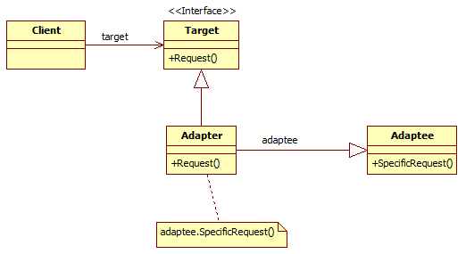

# Adapter 设计模式



## 　　适配器模式参与者：

- Target：Client所使用的目标接口，可以是接口或抽象类。由于C#/Java不支持多类继承，故把Target定义为接口(最终接口定义方)。

- Adaptee：需要适配的类接口(数据提供方 / 行为发生方)。

- Adapter：适配器，负责Adaptee的接口与Target接口进行适配(中间商实现协调调用)。

- Client：与符合Target接口的对象协调的类。

在适配器模式中，类Adapter实现适配器的功能，它在Client于Adaptee之间加入Adapter，这样Client把请求发给接口为Target的类Adapter，再由Adapter调用Adaptee，从而实现Client调用Adaptee。

## CODE
### 1. Taget Interface
```java
public interface ITarget
{
    void Request();
}
```
### 2. Adaptee
```java
public class Adaptee
{
    public void SpecificRequest()
    {
        Console.WriteLine("Called SpecificRequest()");
    }
}
```
### 3. Adapter

#### 3.1 类适配器
```java
public class Adapter extends Adaptee implements ITarget
{
    public void Request()
    {
         this.SpecificRequest();
    }
}
```
#### 3.2 对象适配器
```java
public class Target implements ITarget
{
    public virtual void Request()
    {
        Console.WriteLine("Called Target Request()");
    }
}

public class Adapter extends Target
{
     private Adaptee _adaptee = new Adaptee(); // 注入了Adaptee对象

     @override
     public void Request()
     {
         _adaptee.SpecificRequest();
     }
}
```
### 4. Client
```java
public class Client
{
    public static void Main(string[] args)
    {
         ITarget t = new Adapter();
         t.Request();
    }
}
```
