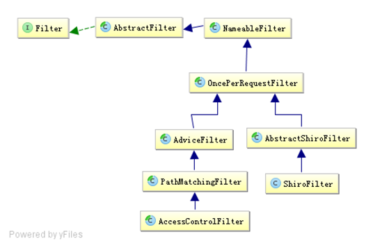

## 1 拦截器介绍

Shiro使用了与Servlet一样的Filter接口进行扩展；所以如果对Filter不熟悉可以参考[《Servlet3.1规范》](http://www.iteye.com/blogs/subjects/Servlet-3-1)了解Filter的工作原理。首先下图是Shiro拦截器的基础类图：



### 1.1 NameableFilter

NameableFilter 给 Filter 起个名字，如果没有设置默认就是FilterName；还记得之前的如authc吗？当我们组装拦截器链时会根据这个名字找到相应的拦截器实例；

 

### 1.2 OncePerRequestFilter

OncePerRequestFilter 用于防止多次执行 Filter 的；也就是说一次请求只会走一次拦截器链；另外提供enabled属性，表示是否开启该拦截器实例，默认enabled=true表示开启，如果不想让某个拦截器工作，可以设置为false即可。

 

### 1.3 ShiroFilter

ShiroFilter是整个Shiro的入口点，用于拦截需要安全控制的请求进行处理，这个之前已经用过了。

 

### 1.4 AdviceFilter

AdviceFilter 提供了AOP风格的支持，类似于 SpringMVC 中的Interceptor：
```java
boolean preHandle(ServletRequest request, ServletResponse response) throws Exception  
void postHandle(ServletRequest request, ServletResponse response) throws Exception  
void afterCompletion(ServletRequest request, ServletResponse response, Exception exception) throws Exception;   
```
 - preHandler：类似于AOP中的前置增强；在拦截器链执行之前执行；如果返回true则继续拦截器链；否则中断后续的拦截器链的执行直接返回；进行预处理（如基于表单的身份验证、授权）

 - postHandle：类似于AOP中的后置返回增强；在拦截器链执行完成后执行；进行后处理（如记录执行时间之类的）；

 - afterCompletion：类似于AOP中的后置最终增强；即不管有没有异常都会执行；可以进行清理资源（如接触Subject与线程的绑定之类的）；

 

### 1.5 PathMatchingFilter

PathMatchingFilter 提供了基于Ant风格的请求路径匹配功能及拦截器参数解析的功能，如“roles[admin,user]”自动根据“，”分割解析到一个路径参数配置并绑定到相应的路径：
```java
boolean pathsMatch(String path, ServletRequest request)  
boolean onPreHandle(ServletRequest request, ServletResponse response, Object mappedValue) throws Exception   
```
 - pathsMatch：该方法用于path与请求路径进行匹配的方法；如果匹配返回true；

 - onPreHandle：在preHandle中，当pathsMatch匹配一个路径后，会调用opPreHandler方法并将路径绑定参数配置传给mappedValue；然后可以在这个方法中进行一些验证（如角色授权），如果验证失败可以返回false中断流程；默认返回true；也就是说子类可以只实现onPreHandle即可，无须实现preHandle。如果没有path与请求路径匹配，默认是通过的（即preHandle返回true）。

 

### 1.6 AccessControlFilter

AccessControlFilter 提供了访问控制的基础功能，比如是否允许访问/当访问拒绝时如何处理等。
```java
    abstract boolean isAccessAllowed(ServletRequest request, ServletResponse response, Object mappedValue) throws Exception;  
    boolean onAccessDenied(ServletRequest request, ServletResponse response, Object mappedValue) throws Exception;  
    abstract boolean onAccessDenied(ServletRequest request, ServletResponse response) throws Exception;   
```
 - isAccessAllowed：表示是否允许访问；mappedValue就是[urls]配置中拦截器参数部分，如果允许访问返回true，否则false；

 - onAccessDenied：表示当访问拒绝时是否已经处理了；如果返回true表示需要继续处理；如果返回false表示该拦截器实例已经处理了，将直接返回即可。

 - onPreHandle会自动调用这两个方法决定是否继续处理：
    ```java
    boolean onPreHandle(ServletRequest request, ServletResponse response, Object mappedValue) throws Exception { 
        return isAccessAllowed(request, response, mappedValue) || onAccessDenied(request, response, mappedValue); 
    }   
    ```
另外AccessControlFilter还提供了如下方法用于处理如登录成功后/重定向到上一个请求： 
```java
void setLoginUrl(String loginUrl) //身份验证时使用，默认/login.jsp  
String getLoginUrl()  
Subject getSubject(ServletRequest request, ServletResponse response) //获取Subject实例  
boolean isLoginRequest(ServletRequest request, ServletResponse response)//当前请求是否是登录请求  
void saveRequestAndRedirectToLogin(ServletRequest request, ServletResponse response) throws IOException //将当前请求保存起来并重定向到登录页面  
void saveRequest(ServletRequest request) //将请求保存起来，如登录成功后再重定向回该请求  
void redirectToLogin(ServletRequest request, ServletResponse response) //重定向到登录页面   
```
比如基于表单的身份验证就需要使用这些功能。

 

到此基本的拦截器就完事了，如果我们想进行访问访问的控制就可以继承AccessControlFilter；如果我们要添加一些通用数据我们可以直接继承PathMatchingFilter。

 
## 2 拦截器链

Shiro对Servlet容器的FilterChain进行了代理，即ShiroFilter在继续Servlet容器的Filter链的执行之前，通过ProxiedFilterChain对Servlet容器的FilterChain进行了代理；即先走Shiro自己的Filter体系，然后才会委托给Servlet容器的FilterChain进行Servlet容器级别的Filter链执行；Shiro的ProxiedFilterChain执行流程：先执行Shiro自己的Filter链；再执行Servlet容器的Filter链（即原始的Filter）。

而ProxiedFilterChain是通过FilterChainResolver根据配置文件中[urls]部分是否与请求的URL是否匹配解析得到的。 
```java
FilterChain getChain(ServletRequest request, ServletResponse response, FilterChain originalChain);  
```
即传入原始的chain得到一个代理的chain。

Shiro内部提供了一个路径匹配的FilterChainResolver实现：PathMatchingFilterChainResolver，其根据[urls]中配置的url模式（默认Ant风格）=拦截器链和请求的url是否匹配来解析得到配置的拦截器链的；而PathMatchingFilterChainResolver内部通过FilterChainManager维护着拦截器链，比如DefaultFilterChainManager实现维护着url模式与拦截器链的关系。因此我们可以通过FilterChainManager进行动态动态增加url模式与拦截器链的关系。

 

DefaultFilterChainManager会默认添加org.apache.shiro.web.filter.mgt.DefaultFilter中声明的拦截器：
```java
public enum DefaultFilter {  
    anon(AnonymousFilter.class),  
    authc(FormAuthenticationFilter.class),  
    authcBasic(BasicHttpAuthenticationFilter.class),  
    logout(LogoutFilter.class),  
    noSessionCreation(NoSessionCreationFilter.class),  
    perms(PermissionsAuthorizationFilter.class),  
    port(PortFilter.class),  
    rest(HttpMethodPermissionFilter.class),  
    roles(RolesAuthorizationFilter.class),  
    ssl(SslFilter.class),  
    user(UserFilter.class);  
}   
```
下一节会介绍这些拦截器的作用。

 

如果要注册自定义拦截器，IniSecurityManagerFactory/WebIniSecurityManagerFactory在启动时会自动扫描ini配置文件中的[filters]/[main]部分并注册这些拦截器到DefaultFilterChainManager；且创建相应的url模式与其拦截器关系链。如果使用Spring后续章节会介绍如果注册自定义拦截器。

 

如果想自定义FilterChainResolver，可以通过实现WebEnvironment接口完成：
```
public class MyIniWebEnvironment extends IniWebEnvironment {  
    @Override  
    protected FilterChainResolver createFilterChainResolver() {  
        //在此处扩展自己的FilterChainResolver  
        return super.createFilterChainResolver();  
    }  
}   
```
FilterChain之间的关系。如果想动态实现url-拦截器的注册，就可以通过实现此处的FilterChainResolver来完成，比如：
```
//1、创建FilterChainResolver  
PathMatchingFilterChainResolver filterChainResolver =  
        new PathMatchingFilterChainResolver();  
//2、创建FilterChainManager  
DefaultFilterChainManager filterChainManager = new DefaultFilterChainManager();  
//3、注册Filter  
for(DefaultFilter filter : DefaultFilter.values()) {  
    filterChainManager.addFilter(  
        filter.name(), (Filter) ClassUtils.newInstance(filter.getFilterClass()));  
}  
//4、注册URL-Filter的映射关系  
filterChainManager.addToChain("/login.jsp", "authc");  
filterChainManager.addToChain("/unauthorized.jsp", "anon");  
filterChainManager.addToChain("/**", "authc");  
filterChainManager.addToChain("/**", "roles", "admin");  

//5、设置Filter的属性  
FormAuthenticationFilter authcFilter =  
         (FormAuthenticationFilter)filterChainManager.getFilter("authc");  
authcFilter.setLoginUrl("/login.jsp");  
RolesAuthorizationFilter rolesFilter =  
          (RolesAuthorizationFilter)filterChainManager.getFilter("roles");  
rolesFilter.setUnauthorizedUrl("/unauthorized.jsp");  

filterChainResolver.setFilterChainManager(filterChainManager);  
return filterChainResolver;   
```
此处自己去实现注册filter，及url模式与filter之间的映射关系。可以通过定制FilterChainResolver或FilterChainManager来完成诸如动态URL匹配的实现。

 

然后再web.xml中进行如下配置Environment：  
```xml
<context-param>  
<param-name>shiroEnvironmentClass</param-name>
<param-value>com.github.zhangkaitao.shiro.chapter8.web.env.MyIniWebEnvironment</param-value>  
</context-param>   
```
 
## 3 自定义拦截器

通过自定义自己的拦截器可以扩展一些功能，诸如动态url-角色/权限访问控制的实现、根据Subject身份信息获取用户信息绑定到Request（即设置通用数据）、验证码验证、在线用户信息的保存等等，因为其本质就是一个Filter；所以Filter能做的它就能做。

 

对于Filter的介绍请参考《Servlet规范》中的[Filter部分](http://www.iteye.com/blogs/subjects/Servlet-3-1)。

 

### 3.1 扩展 OncePerRequestFilter

OncePerRequestFilter保证一次请求只调用一次doFilterInternal，即如内部的forward不会再多执行一次doFilterInternal： 
```
public class MyOncePerRequestFilter extends OncePerRequestFilter {  
    @Override  
    protected void doFilterInternal(ServletRequest request, ServletResponse response, FilterChain chain) 
                                    throws ServletException, IOException {  
        System.out.println("=========once per request filter");  
        chain.doFilter(request, response);  
    }  
}   
```
然后再shiro.ini配置文件中：
```
[main]  
myFilter1=com.github.zhangkaitao.shiro.chapter8.web.filter.MyOncePerRequestFilter  
#[filters]  
#myFilter1=com.github.zhangkaitao.shiro.chapter8.web.filter.MyOncePerRequestFilter  
[urls]  
/**=myFilter1   
```
Filter可以在[main]或[filters]部分注册，然后在[urls]部分配置url与filter的映射关系即可。

 

### 3.2、扩展AdviceFilter

AdviceFilter提供了AOP的功能，其实现和SpringMVC中的Interceptor思想一样：具体可参考我的SpringMVC教程中的处理器拦截器部分：

http://www.iteye.com/blogs/subjects/kaitao-springmvc
```

    public class MyAdviceFilter extends AdviceFilter {  
        @Override  
        protected boolean preHandle(ServletRequest request, ServletResponse response) throws Exception {  
            System.out.println("====预处理/前置处理");  
            return true;//返回false将中断后续拦截器链的执行  
        }  
        @Override  
        protected void postHandle(ServletRequest request, ServletResponse response) throws Exception {  
            System.out.println("====后处理/后置返回处理");  
        }  
        @Override  
        public void afterCompletion(ServletRequest request, ServletResponse response, Exception exception) throws Exception {  
            System.out.println("====完成处理/后置最终处理");  
        }  
    }   
```
preHandle：进行请求的预处理，然后根据返回值决定是否继续处理（true：继续过滤器链）；可以通过它实现权限控制；

postHandle：执行完拦截器链之后正常返回后执行；

afterCompletion：不管最后有没有异常，afterCompletion都会执行，完成如清理资源功能。

 

然后在shiro.ini中进行如下配置： 
```

    [filters]  
    myFilter1=com.github.zhangkaitao.shiro.chapter8.web.filter.MyOncePerRequestFilter  
    myFilter2=com.github.zhangkaitao.shiro.chapter8.web.filter.MyAdviceFilter  
    [urls]  
    /**=myFilter1,myFilter2   
```
该过滤器的具体使用可参考我的SpringMVC教程中的处理器拦截器部分。

 

### 3.3、PathMatchingFilter

PathMatchingFilter继承了AdviceFilter，提供了url模式过滤的功能，如果需要对指定的请求进行处理，可以扩展PathMatchingFilter： 
```

    public class MyPathMatchingFilter extends PathMatchingFilter {  
        @Override  
        protected boolean onPreHandle(ServletRequest request, ServletResponse response, Object mappedValue) throws Exception {  
           System.out.println("url matches,config is " + Arrays.toString((String[])mappedValue));  
           return true;  
        }  
    }   
```
preHandle：会进行url模式与请求url进行匹配，如果匹配会调用onPreHandle；如果没有配置url模式/没有url模式匹配，默认直接返回true；

onPreHandle：如果url模式与请求url匹配，那么会执行onPreHandle，并把该拦截器配置的参数传入。默认什么不处理直接返回true。

 

然后在shiro.ini中进行如下配置：
```

    [filters]  
    myFilter3=com.github.zhangkaitao.shiro.chapter8.web.filter.MyPathMatchingFilter  
    [urls]  
    /**= myFilter3[config]   
```
/\*\*就是注册给PathMatchingFilter的url模式，config就是拦截器的配置参数，多个之间逗号分隔，onPreHandle使用mappedValue接收参数值。

 

### 3.4、扩展AccessControlFilter

AccessControlFilter继承了PathMatchingFilter，并扩展了了两个方法：
```

    public boolean onPreHandle(ServletRequest request, ServletResponse response, Object mappedValue) throws Exception {  
        return isAccessAllowed(request, response, mappedValue)  
         || onAccessDenied(request, response, mappedValue);  
    }   
```
isAccessAllowed：即是否允许访问，返回true表示允许；

onAccessDenied：表示访问拒绝时是否自己处理，如果返回true表示自己不处理且继续拦截器链执行，返回false表示自己已经处理了（比如重定向到另一个页面）。

   
```

    public class MyAccessControlFilter extends AccessControlFilter {  
        protected boolean isAccessAllowed(ServletRequest request, ServletResponse response, Object mappedValue) throws Exception {  
            System.out.println("access allowed");  
            return true;  
        }  
        protected boolean onAccessDenied(ServletRequest request, ServletResponse response) throws Exception {  
            System.out.println("访问拒绝也不自己处理，继续拦截器链的执行");  
            return true;  
        }  
    }   
```
然后在shiro.ini中进行如下配置：
```

    [filters]  
    myFilter4=com.github.zhangkaitao.shiro.chapter8.web.filter.MyAccessControlFilter  
    [urls]  
    /**=myFilter4  
```
  

### 3.5、基于表单登录拦截器 

之前我们已经使用过Shiro内置的基于表单登录的拦截器了，此处自己做一个类似的基于表单登录的拦截器。
```

    public class FormLoginFilter extends PathMatchingFilter {  
        private String loginUrl = "/login.jsp";  
        private String successUrl = "/";  
        @Override  
        protected boolean onPreHandle(ServletRequest request, ServletResponse response, Object mappedValue) throws Exception {  
            if(SecurityUtils.getSubject().isAuthenticated()) {  
                return true;//已经登录过  
            }  
            HttpServletRequest req = (HttpServletRequest) request;  
            HttpServletResponse resp = (HttpServletResponse) response;  
            if(isLoginRequest(req)) {  
                if("post".equalsIgnoreCase(req.getMethod())) {//form表单提交  
                    boolean loginSuccess = login(req); //登录  
                    if(loginSuccess) {  
                        return redirectToSuccessUrl(req, resp);  
                    }  
                }  
                return true;//继续过滤器链  
            } else {//保存当前地址并重定向到登录界面  
                saveRequestAndRedirectToLogin(req, resp);  
                return false;  
            }  
        }  
        private boolean redirectToSuccessUrl(HttpServletRequest req, HttpServletResponse resp) throws IOException {  
            WebUtils.redirectToSavedRequest(req, resp, successUrl);  
            return false;  
        }  
        private void saveRequestAndRedirectToLogin(HttpServletRequest req, HttpServletResponse resp) throws IOException {  
            WebUtils.saveRequest(req);  
            WebUtils.issueRedirect(req, resp, loginUrl);  
        }  
      
        private boolean login(HttpServletRequest req) {  
            String username = req.getParameter("username");  
            String password = req.getParameter("password");  
            try {  
                SecurityUtils.getSubject().login(new UsernamePasswordToken(username, password));  
            } catch (Exception e) {  
                req.setAttribute("shiroLoginFailure", e.getClass());  
                return false;  
            }  
            return true;  
        }  
        private boolean isLoginRequest(HttpServletRequest req) {  
            return pathsMatch(loginUrl, WebUtils.getPathWithinApplication(req));  
        }  
    }   
```
onPreHandle主要流程：

1、首先判断是否已经登录过了，如果已经登录过了继续拦截器链即可；

2、如果没有登录，看看是否是登录请求，如果是get方法的登录页面请求，则继续拦截器链（到请求页面），否则如果是get方法的其他页面请求则保存当前请求并重定向到登录页面；

3、如果是post方法的登录页面表单提交请求，则收集用户名/密码登录即可，如果失败了保存错误消息到“shiroLoginFailure”并返回到登录页面；

4、如果登录成功了，且之前有保存的请求，则重定向到之前的这个请求，否则到默认的成功页面。

 

shiro.ini配置
```

    [filters]  
    formLogin=com.github.zhangkaitao.shiro.chapter8.web.filter.FormLoginFilter  
    [urls]  
    /test.jsp=formLogin  
    /login.jsp=formLogin   
```
启动服务器输入http://localhost:8080/chapter8/test.jsp测试时，会自动跳转到登录页面，登录成功后又会跳回到test.jsp页面。

 

此处可以通过继承AuthenticatingFilter实现，其提供了很多登录相关的基础代码。另外可以参考Shiro内嵌的FormAuthenticationFilter的源码，思路是一样的。

 

### 3.6、任意角色授权拦截器

Shiro提供roles拦截器，其验证用户拥有所有角色，没有提供验证用户拥有任意角色的拦截器。
```

    public class AnyRolesFilter extends AccessControlFilter {  
        private String unauthorizedUrl = "/unauthorized.jsp";  
        private String loginUrl = "/login.jsp";  
        protected boolean isAccessAllowed(ServletRequest request, ServletResponse response, Object mappedValue) throws Exception {  
            String[] roles = (String[])mappedValue;  
            if(roles == null) {  
                return true;//如果没有设置角色参数，默认成功  
            }  
            for(String role : roles) {  
                if(getSubject(request, response).hasRole(role)) {  
                    return true;  
                }  
            }  
            return false;//跳到onAccessDenied处理  
        }  
      
        @Override  
        protected boolean onAccessDenied(ServletRequest request, ServletResponse response) throws Exception {  
            Subject subject = getSubject(request, response);  
            if (subject.getPrincipal() == null) {//表示没有登录，重定向到登录页面  
                saveRequest(request);  
                WebUtils.issueRedirect(request, response, loginUrl);  
            } else {  
                if (StringUtils.hasText(unauthorizedUrl)) {//如果有未授权页面跳转过去  
                    WebUtils.issueRedirect(request, response, unauthorizedUrl);  
                } else {//否则返回401未授权状态码  
                    WebUtils.toHttp(response).sendError(HttpServletResponse.SC_UNAUTHORIZED);  
                }  
            }  
            return false;  
        }  
    }   
```
流程：

1、首先判断用户有没有任意角色，如果没有返回false，将到onAccessDenied进行处理；

2、如果用户没有角色，接着判断用户有没有登录，如果没有登录先重定向到登录；

3、如果用户没有角色且设置了未授权页面（unauthorizedUrl），那么重定向到未授权页面；否则直接返回401未授权错误码。

 

shiro.ini配置
```

    [filters]  
    anyRoles=com.github.zhangkaitao.shiro.chapter8.web.filter.AnyRolesFilter  
    [urls]  
    /test.jsp=formLogin,anyRoles[admin,user]  
    /login.jsp=formLogin   
```
此处可以继承AuthorizationFilter实现，其提供了授权相关的基础代码。另外可以参考Shiro内嵌的RolesAuthorizationFilter的源码，只是实现hasAllRoles逻辑。

 
## 4 默认拦截器

Shiro内置了很多默认的拦截器，比如身份验证、授权等相关的。默认拦截器可以参考org.apache.shiro.web.filter.mgt.DefaultFilter中的枚举拦截器：  

<table cellpadding="0" border="1" class="aa" cellspacing="0" style="border-collapse: collapse; border: 1px none; width: 100%; table-layout: fixed;">
<tbody><tr>
<td style="padding: 0cm 5.4pt 0cm 5.4pt; width: 150px;">
<p class="MsoNormal">默认拦截器名</p>
</td>
<td style="border-left: none; padding: 0cm 5.4pt 0cm 5.4pt; width: 215px;">
<p class="MsoNormal">拦截器类</p>
</td>
<td style="border-left: none; padding: 0cm 5.4pt 0cm 5.4pt;">
<p class="MsoNormal">说明（括号里的表示默认值）</p>
</td>
</tr>
<tr>
<td style="border-top: none; padding: 0cm 5.4pt 0cm 5.4pt;">
<p class="MsoNormal"><strong>身份验证相关的</strong></p>
</td>
<td style="border-top: none; border-left: none; padding: 0cm 5.4pt 0cm 5.4pt;">
<p class="MsoNormal">&nbsp;</p>
</td>
<td style="border-top: none; border-left: none; padding: 0cm 5.4pt 0cm 5.4pt;">
<p class="MsoNormal">&nbsp;</p>
</td>
</tr>
<tr>
<td style="border-top: none; padding: 0cm 5.4pt 0cm 5.4pt;">
<p class="MsoNormal">authc</p>
</td>
<td style="border-top: none; border-left: none; padding: 0cm 5.4pt 0cm 5.4pt;">
<p class="MsoNormal">org.apache.shiro.web.filter.authc</p>
<p class="MsoNormal">.FormAuthenticationFilter</p>
</td>
<td style="border-top: none; border-left: none; padding: 0cm 5.4pt 0cm 5.4pt;">
<p class="MsoNormal">基于表单的拦截器；如“/\*\*=authc”，如果没有登录会跳到相应的登录页面登录；主要属性：usernameParam：表单提交的用户名参数名（ username）； &nbsp;passwordParam：表单提交的密码参数名（password）； rememberMeParam：表单提交的密码参数名（rememberMe）；&nbsp; loginUrl：登录页面地址（/login.jsp）；successUrl：登录成功后的默认重定向地址； failureKeyAttribute：登录失败后错误信息存储key（shiroLoginFailure）；</p>
</td>
</tr>
<tr>
<td style="border-top: none; padding: 0cm 5.4pt 0cm 5.4pt;">
<p class="MsoNormal">authcBasic</p>
</td>
<td style="border-top: none; border-left: none; padding: 0cm 5.4pt 0cm 5.4pt;">
<p class="MsoNormal">org.apache.shiro.web.filter.authc</p>
<p class="MsoNormal">.BasicHttpAuthenticationFilter</p>
</td>
<td style="border-top: none; border-left: none; padding: 0cm 5.4pt 0cm 5.4pt;">
<p class="MsoNormal">Basic HTTP身份验证拦截器，主要属性： applicationName：弹出登录框显示的信息（application）；</p>
</td>
</tr>
<tr>
<td style="border-top: none; padding: 0cm 5.4pt 0cm 5.4pt;">
<p class="MsoNormal">logout</p>
</td>
<td style="border-top: none; border-left: none; padding: 0cm 5.4pt 0cm 5.4pt;">
<p class="MsoNormal">org.apache.shiro.web.filter.authc</p>
<p class="MsoNormal">.LogoutFilter</p>
</td>
<td style="border-top: none; border-left: none; padding: 0cm 5.4pt 0cm 5.4pt;">
<p class="MsoNormal">退出拦截器，主要属性：redirectUrl：退出成功后重定向的地址（/）;示例“/logout=logout”</p>
</td>
</tr>
<tr>
<td style="border-top: none; padding: 0cm 5.4pt 0cm 5.4pt;">
<p class="MsoNormal">user</p>
</td>
<td style="border-top: none; border-left: none; padding: 0cm 5.4pt 0cm 5.4pt;">
<p class="MsoNormal">org.apache.shiro.web.filter.authc</p>
<p class="MsoNormal">.UserFilter</p>
</td>
<td style="border-top: none; border-left: none; padding: 0cm 5.4pt 0cm 5.4pt;">
<p class="MsoNormal">用户拦截器，用户已经身份验证/记住我登录的都可；示例“/**=user”</p>
</td>
</tr>
<tr>
<td style="border-top: none; padding: 0cm 5.4pt 0cm 5.4pt;">
<p class="MsoNormal">anon</p>
</td>
<td style="border-top: none; border-left: none; padding: 0cm 5.4pt 0cm 5.4pt;">
<p class="MsoNormal">org.apache.shiro.web.filter.authc</p>
<p class="MsoNormal">.AnonymousFilter</p>
</td>
<td style="border-top: none; border-left: none; padding: 0cm 5.4pt 0cm 5.4pt;">
<p class="MsoNormal">匿名拦截器，即不需要登录即可访问；一般用于静态资源过滤；示例“/static/**=anon”</p>
</td>
</tr>
<tr>
<td style="border-top: none; padding: 0cm 5.4pt 0cm 5.4pt;">
<p class="MsoNormal"><strong>授权相关的</strong></p>
</td>
<td style="border-top: none; border-left: none; padding: 0cm 5.4pt 0cm 5.4pt;">
<p class="MsoNormal">&nbsp;</p>
</td>
<td style="border-top: none; border-left: none; padding: 0cm 5.4pt 0cm 5.4pt;">
<p class="MsoNormal">&nbsp;</p>
</td>
</tr>
<tr>
<td style="border-top: none; padding: 0cm 5.4pt 0cm 5.4pt;">
<p class="MsoNormal">roles</p>
</td>
<td style="border-top: none; border-left: none; padding: 0cm 5.4pt 0cm 5.4pt;">
<p class="MsoNormal">org.apache.shiro.web.filter.authz</p>
<p class="MsoNormal">.RolesAuthorizationFilter</p>
</td>
<td style="border-top: none; border-left: none; padding: 0cm 5.4pt 0cm 5.4pt;">
<p class="MsoNormal">角色授权拦截器，验证用户是否拥有所有角色；主要属性： loginUrl：登录页面地址（/login.jsp）；unauthorizedUrl：未授权后重定向的地址；示例“/admin/**=roles[admin]”</p>
</td>
</tr>
<tr>
<td style="border-top: none; padding: 0cm 5.4pt 0cm 5.4pt;">
<p class="MsoNormal">perms</p>
</td>
<td style="border-top: none; border-left: none; padding: 0cm 5.4pt 0cm 5.4pt;">
<p class="MsoNormal">org.apache.shiro.web.filter.authz</p>
<p class="MsoNormal">.PermissionsAuthorizationFilter</p>
</td>
<td style="border-top: none; border-left: none; padding: 0cm 5.4pt 0cm 5.4pt;">
<p class="MsoNormal">权限授权拦截器，验证用户是否拥有所有权限；属性和roles一样；示例“/user/**=perms["user:create"]”</p>
</td>
</tr>
<tr>
<td style="border-top: none; padding: 0cm 5.4pt 0cm 5.4pt;">
<p class="MsoNormal">port</p>
</td>
<td style="border-top: none; border-left: none; padding: 0cm 5.4pt 0cm 5.4pt;">
<p class="MsoNormal">org.apache.shiro.web.filter.authz</p>
<p class="MsoNormal">.PortFilter</p>
</td>
<td style="border-top: none; border-left: none; padding: 0cm 5.4pt 0cm 5.4pt;">
<p class="MsoNormal">端口拦截器，主要属性：port（80）：可以通过的端口；示例“/test= port[80]”，如果用户访问该页面是非80，将自动将请求端口改为80并重定向到该80端口，其他路径/参数等都一样</p>
</td>
</tr>
<tr>
<td style="border-top: none; padding: 0cm 5.4pt 0cm 5.4pt;">
<p class="MsoNormal">rest</p>
</td>
<td style="border-top: none; border-left: none; padding: 0cm 5.4pt 0cm 5.4pt;">
<p class="MsoNormal">org.apache.shiro.web.filter.authz</p>
<p class="MsoNormal">.HttpMethodPermissionFilter</p>
</td>
<td style="border-top: none; border-left: none; padding: 0cm 5.4pt 0cm 5.4pt;">
<p class="MsoNormal">rest风格拦截器，自动根据请求方法构建权限字符串（GET=read, POST=create,PUT=update,DELETE=delete,HEAD=read,TRACE=read,OPTIONS=read, MKCOL=create）构建权限字符串；示例“/users=rest[user]”，会自动拼出“user:read,user:create,user:update,user:delete”权限字符串进行权限匹配（所有都得匹配，isPermittedAll）；</p>
</td>
</tr>
<tr>
<td style="border-top: none; padding: 0cm 5.4pt 0cm 5.4pt;">
<p class="MsoNormal">ssl</p>
</td>
<td style="border-top: none; border-left: none; padding: 0cm 5.4pt 0cm 5.4pt;">
<p class="MsoNormal">org.apache.shiro.web.filter.authz</p>
<p class="MsoNormal">.SslFilter</p>
</td>
<td style="border-top: none; border-left: none; padding: 0cm 5.4pt 0cm 5.4pt;">
<p class="MsoNormal">SSL拦截器，只有请求协议是https才能通过；否则自动跳转会https端口（443）；其他和port拦截器一样；</p>
</td>
</tr>
<tr>
<td style="border-top: none; padding: 0cm 5.4pt 0cm 5.4pt;">
<p class="MsoNormal"><strong>其他</strong></p>
</td>
<td style="border-top: none; border-left: none; padding: 0cm 5.4pt 0cm 5.4pt;">
<p class="MsoNormal">&nbsp;</p>
</td>
<td style="border-top: none; border-left: none; padding: 0cm 5.4pt 0cm 5.4pt;">
<p class="MsoNormal">&nbsp;</p>
</td>
</tr>
<tr>
<td style="border-top: none; padding: 0cm 5.4pt 0cm 5.4pt;">
<p class="MsoNormal">noSessionCreation</p>
</td>
<td style="border-top: none; border-left: none; padding: 0cm 5.4pt 0cm 5.4pt;">
<p class="MsoNormal">org.apache.shiro.web.filter.session</p>
<p class="MsoNormal">.NoSessionCreationFilter</p>
</td>
<td style="border-top: none; border-left: none; padding: 0cm 5.4pt 0cm 5.4pt;">
<p class="MsoNormal">不创建会话拦截器，调用 subject.getSession(false)不会有什么问题，但是如果 subject.getSession(true)将抛出 DisabledSessionException异常；</p>
</td>
</tr>
</tbody></table>
 

另外还提供了一个org.apache.shiro.web.filter.authz.HostFilter，即主机拦截器，比如其提供了属性：authorizedIps：已授权的ip地址，deniedIps：表示拒绝的ip地址；不过目前还没有完全实现，不可用。

 

这些默认的拦截器会自动注册，可以直接在ini配置文件中通过“拦截器名.属性”设置其属性：
```
perms.unauthorizedUrl=/unauthorized  
```
另外如果某个拦截器不想使用了可以直接通过如下配置直接禁用：
```
perms.enabled=false  
```